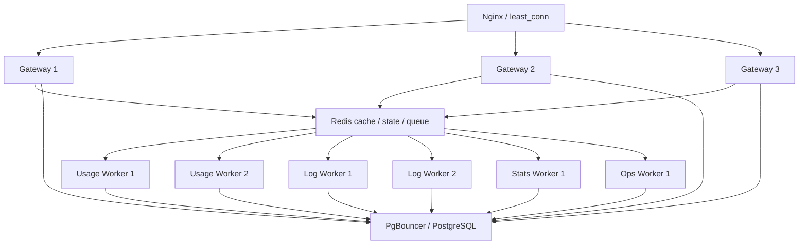

# 高性能模式同机多进程拓扑设计

> 本文定义当前 Node 阶段在单台高性能主机上的多进程拓扑。它只适用于
> `JUHE_AI_RUNTIME_MODE=performance`；`standalone` 继续使用单 server、单 DB service
> 和既有三角色 worker，不能因为本设计增加 Redis、Nginx 或多副本启动要求。

## 背景与目标

AI 中转的首要目标是维持客户端会话和流式输出。使用记录、审计、运行日志和统计
都是重要事实或运维能力，但它们异常时必须从网关主事件循环隔离，不能反向阻断已
建立的 AI 请求。

生产现场已经确认，大 JSON、上游重试和高频阶段日志会同时放大主 server 的 RSS、
external Buffer 与事件循环延迟。Redis queue 进程仍可用时，主进程也可能因为事件
循环停顿超过命令超时而无法完成 `XADD`。因此本设计不把问题简化为增加同一进程内
的异步并发，而是用同机多 Node 进程切开事件循环和内存故障域。

目标：

- Nginx 默认把 AI 请求分配到 3 个独立 Gateway 进程，使用 `least_conn` 适配长连接。
- Usage 与 Log 分离为独立 Redis Stream consumer group 消费进程，默认各 2 个副本。
- Stats 保持单副本，避免同一统计窗口重复计算；Ops 保持单副本处理控制面外部 I/O。
- 旁路积压只降低旁路新鲜度，不中断已经建立的 AI 流。
- 所有副本数都由部署配置控制，但默认值构成可直接使用的 performance 最小单元。
- standalone 的启动命令、进程数量、SQLite 单写者和本地 IPC 行为保持不变。

## 进程拓扑



默认副本：

| 角色 | performance 默认 | standalone | 扩容依据 |
| --- | ---: | ---: | --- |
| Gateway | 3 | 1 | 活跃流、事件循环延迟、RSS、待解析字节 |
| Usage Worker | 2 | 不启用 | usage stream lag、最老消息年龄、批量落库耗时 |
| Log Worker | 2 | 不启用 | audit / operation / public API stream lag、日志文件 backlog |
| Stats Worker | 1 | 既有 1 个 | 统计 freshness；扩容前必须先设计分片租约 |
| Ops Worker | 1 | 既有 1 个 | 外部探测队列等待时间；当前不复制定时任务 |

performance 使用以下部署配置：

```dotenv
JUHE_AI_GATEWAY_REPLICAS=3
JUHE_AI_USAGE_WORKER_REPLICAS=2
JUHE_AI_LOG_WORKER_REPLICAS=2
JUHE_AI_STATS_WORKER_REPLICAS=1
JUHE_AI_OPS_WORKER_REPLICAS=1
```

副本数只决定同机进程编排，不改变业务分片或系统账户归属。本文不是跨主机分布式
部署设计，不引入 leader、home node、跨节点转发或复制因子。

## 角色边界

### Gateway

- 只承担鉴权、路由、上游请求、重试、协议转换和流式转发。
- 使用 Redis 共享账户并发、熔断、短 TTL 状态和缓存版本，禁止依赖进程内状态实现
  跨 Gateway 全局约束。
- 使用记录和审计只生成一次稳定 `event_id` 后异步投递；Redis 不可用时进入独立持久
  补偿通道，不等待旁路恢复后才向客户端输出。
- 每个实例使用独立端口、实例 ID 和日志文件，避免多个进程同时写一个 JSONL 文件。
- 退出时先由 Nginx 摘流，再等待活跃连接排空；不得直接杀死仍在输出的 AI 流。

### Usage Worker

- 只消费 usage Redis Stream，并批量写入 `juhe_usage.usage_records`。
- 所有副本属于同一个 consumer group，每个副本使用唯一 consumer name。
- 数据库以 `(created_at, id)` 唯一约束兜底；数据库提交成功但 ACK 超时后的重投必须
  成为幂等 no-op。
- 只有副本 `0` 执行 usage 相关单例维护和 dataset typed write；其他副本只消费事实。

### Log Worker

- 消费 audit、operation log 和 public API log 三类 Redis Stream。
- 所有副本在各自 stream 的同一个 group 内竞争消息，数据库主键保证重投幂等。
- 普通运行日志仍先落每个进程独立 JSONL 文件。文件 importer 在首期只由副本 `0`
  运行，禁止两个 importer 推进同一个文件 cursor。
- 当日志压力升高时，先降低普通成功阶段日志和停止索引维护；失败、审计和 usage 不
  因普通日志拥塞被丢弃。

### Stats 与 Ops

- Stats 默认单副本，承担聚合、窗口、系统指标和表监控。增加副本前必须按 job / shard
  增加租约和 fencing token，不能只复制进程。
- Ops 默认单副本，承担账号测试、健康检测、OAuth 刷新、代理探测和控制面维护。
- 两类角色都不能承担 Gateway 请求或高频 append-only 消费。

## 节点级可观测性

- `performance` 下每个 Gateway、Control、DB service 和 worker 副本都以独立角色名发布
  事件循环、RSS 与 Heap 样本，例如 `gateway:gateway-1`、`usage-worker:2`。
- 样本只写 cache Redis 的独立 namespace，5 秒刷新、20 秒 TTL；进程退出后自动消失，
  不把注册表变成新的权威状态或恢复依赖。
- Stats Worker 优先汇总注册表，因此能够观察不属于 Control 子进程树的 Gateway 和非主
  Usage / Log 副本；注册表超时或 Redis 不可用时回退现有 IPC 采样。
- 注册、扫描和读取都有 800ms 硬上限、最大 128 个节点；任何失败只损失本轮指标，不能
  阻塞 AI 请求、worker 消费或 Stats 后续周期。
- 注册表中的退出节点在 TTL 后消失；统计库的 latest 查询只接受最近 2 分钟样本，避免
  历史 PID 被管理页长期标成正常。24 小时峰值和趋势仍保留用于复盘。
- `standalone` 不启动注册表，仍保留 `server`、`ingest-worker`、`stats-worker`、
  `ops-worker`、`db-service` 五个既有角色，避免引入 Redis 依赖或改变本机面板。

## 数据唯一性与恢复

- Redis Stream group 保证一条消息正常情况下只交给组内一个 consumer；pending 超过
  claim idle 后允许其他副本接管。
- consumer 必须先提交 PostgreSQL，再 `XACK + XDEL`。ACK 结果不确定时允许重领，
  依靠稳定业务 ID 和数据库唯一约束去重。
- Gateway 在第一次投递前生成稳定 usage / audit ID；有界重试和持久补偿都复用该 ID。
- 每个 Gateway 的补偿目录按实例 ID 隔离。补偿文件必须先落临时文件再原子 rename，
  重放成功后才删除；不得让多个 Gateway 同时扫描同一个活动目录。
- Redis client 出现命令超时、offline、socket close 或连接代际失效时，调用方淘汰缓存
  client 并单飞重建。只增加命令超时不能作为修复。

## Nginx 路由

- `/v1/*` 和其他 OpenAI 兼容入口进入 Gateway upstream，使用 `least_conn`。
- 管理后台、System/Public API 和 `/__aiinternal__` 账号测试/健康探针入口固定进入
  control / DB service，不与大请求共用 Gateway upstream。
- upstream 重试只适用于尚未发送请求体或尚未向客户端输出的安全阶段；已经开始的
  SSE 不做透明跨进程迁移。
- 健康检查区分 liveness 与 readiness。单个 Gateway 旁路队列异常仍可保持 AI 数据面
  ready；无法鉴权、无法获得路由快照或无法连接任何上游时才退出 ready。

## main / temporary 双槽发布

- 生产固定保留 `main` 与 `temporary` 两套槽位身份。两槽的 control/gateway 端口、
  launchd label、run script 和实例 ID 完全隔离，共享 PostgreSQL、Redis 和 usage spool；
  Nginx 3099 在任一时刻只接纳一个活动槽的新请求。
- 发布先在 inactive slot 启动完整候选并逐节点验证，再通过 Nginx graceful reload 原子
  切流。旧 Nginx worker 和旧 Gateway 继续完成已建立的 SSE，不允许切流后立即 bootout。
- 只有旧槽全部 control/gateway 端口的 Nginx established connection 连续归零，才允许
  替换或退役旧槽。排空超过窗口时保持新槽服务并延期升级，不能以强杀长流换取发布完成。
- inactive slot 排空后可原地升级；健康后切回，再用同一排空门禁清理 temporary。
  清理只退役精确的 slot plist/run script，保留不可变 release 和日志作为回滚证据。
- 首次从 standalone 切到 performance 时，旧 standalone 就是回滚槽；性能 main 全部健康
  并切流后先排空旧 3001/3002，再持久退役旧 launchd。以后所有应用发布都走双槽，
  不得回到停掉唯一活动拓扑再启动候选的流程。
- main 与 temporary 短暂并存时，Usage/Log 依靠 Redis consumer group 分摊且由稳定 ID
  去重；Stats/Ops 使用既有 job lease。模型目录 dirty 扫描只在 control 运行，并增加
  跨槽 Redis 租约；没有 dirty generation 时只做一次空查询，不执行任何重建。

## 降级顺序

发生事件循环或内存压力时按以下顺序释放资源：

1. 停止普通成功阶段日志，保留终态摘要、warn、error、fatal 和审计事实。
2. 暂停运行日志索引、统计窗口和低优先级维护任务。
3. Redis producer client 后台重建，usage / audit 进入持久补偿。
4. 保持已有 AI 流和故障切换；对新请求只做按实例的公平排队和硬内存保护。
5. 只有继续接收新请求会导致 OOM 并伤害现有流时，才由 Nginx 暂时摘除该实例。

禁止因为 usage、log 或 stats 短暂不可用而对全部客户端返回 503。

## 验收标准

- standalone 不配置新环境变量时仍只启动既有单 server 拓扑，现有回归全部通过。
- performance 默认可以同时看到 3 个 Gateway、2 个 Usage、2 个 Log、1 个 Stats 和
  1 个 Ops 进程，且每个实例有唯一 ID；系统指标页能够区分每个进程而非聚合成一个
  `server` / `worker`。
- 两个 Usage / Log consumer 在同组内分摊消息；故意杀死一个 consumer 后 pending 能
  被另一个接管，数据库没有重复事实。
- 停止 Redis queue 后，AI 流继续输出，usage 进入持久补偿；恢复后补写且前端使用记录
  重新推进。
- 停止一个 Gateway 后，Nginx 只把新连接发给其余实例，其他已有 AI 流不受影响。
- Log / Stats 人为制造积压时，Gateway 事件循环和流式首 token 不出现同进程级联停顿。
- 发布支持 main/temporary 摘流、AI 长连接排空、inactive slot 替换和完整回滚。
