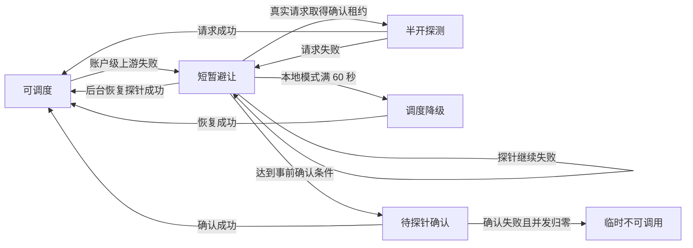

# PLAN-0101 AI 账户运行状态展示收敛 Implementation Plan

> **For agentic workers:** REQUIRED SUB-SKILL: Use `superpowers:subagent-driven-development` (recommended) or `superpowers:executing-plans` to implement this plan task-by-task. Steps use checkbox (`- [ ]`) syntax for tracking.

**Goal:** 在不改变 AI 账户列表布局、不整页轮询的前提下，让主状态标签以最多 100 个当前账户的轻量状态快照持续对应后端真实调度行为。

**Architecture:** 完整账户列表继续负责分页和非状态资料；新增有界的账户状态快照读取，只查询有效可用性所需的持久事实，并按请求账户批量合并本地或 Redis 网关运行态。前端仅在账户页可见时以 `10 秒 ± 1 秒`递归刷新当前已加载的前 100 个账户，并按 ID 显式合并状态字段；现有 PC、移动端和悬浮卡片结构不变。

**Tech Stack:** Node.js、TypeScript、Express、SQLite / PostgreSQL、Redis、Vue 3、Ant Design Vue、现有 regression scripts、PowerShell 7。

---

## 基本信息

- 编号：PLAN-0101
- 状态：待开始
- 创建时间：2026-07-16
- 更新时间：2026-07-16
- 需求来源：用户对话与代码复核
- 执行者：后续实施任务的执行 AI
- 关联模块：AI 账户 / 网关运行态 / Redis runtime state / 状态快照 API / 前端账户列表 / 文档 / 验证

## 需求目标

- 背景：账户列表当前使用“正常”作为正向兜底，并且列表加载后不会持续取得运行态变化。账户已经被网关短暂避让、半开探测、调度降级或等待探针时，用户仍可能看到旧的“正常”，进而把账户级配置状态误解为请求一定可用。
- 目标：主标签只展示后端已经确认的账户级状态；正向文案固定为“可调度”，但不承诺任意模型、协议、额度或并发条件下都能承接请求。
- 交付物：轻量状态投影 repository、批量状态快照接口、本地与 Redis 真实运行态读取、前端有界轮询控制器、状态字段合并、回归测试、长期功能文档和验证记录。

## 已确认事实与纠偏

### 真实生产状态链



- 本地避让阶梯是 `3s -> 5s -> 10s`，但它不是页面轮询周期。
- 本地 `degraded` 门槛仍是至少 2 次失败且首末跨度至少 60 秒。
- `localAccountDegradationObservationAvailability()` 返回 `normal` 的辅助路径只有回归脚本直接调用，不能把它误写成生产必经状态。
- 本计划不新增 `failure_observed` / “失败观察中”，也不修改调度阈值、候选排序、阻断条件或持久状态转换。

### 用户可见状态

| 后端事实 | 主标签 | 颜色 | 账户级语义 |
| --- | --- | --- | --- |
| `effectiveAvailability.available = true` 且运行态读取成功 | 可调度 | green | 当前没有已知账户级阻断，可以进入候选 |
| `runtime_degraded` | 调度降级 | gold | 普通候选不足时仍可兜底 |
| `runtime_local_suppressed` | 短暂避让 | gold | 当前短窗口不进入普通候选 |
| `runtime_half_open` | 半开探测 | blue | 仅确认租约请求可尝试 |
| `runtime_precheck_pending` | 待探针确认 | blue | 确认完成前不进入普通候选 |
| `runtime_precheck_failed` | 探针确认失败 | gold | 当前运行态窗口不进入普通候选 |
| 运行态读取失败，且没有持久硬阻断 | 运行态未知 | default | 页面不对运行健康作正向承诺 |
| 停用、异常、限流、冷却、授权失效等 | 沿用现有标签 | 现有颜色 | 持久或授权硬阻断优先 |

“可调度”的悬浮说明固定为：

```text
账户当前没有已知的账户级阻断，可以进入调度候选；是否承接具体请求仍取决于模型、协议、额度和并发条件。
```

## 范围边界

### 本次包含

- [ ] 基础正向标签从“正常”改为“可调度”。
- [ ] 新增最多 100 个账户 ID 的轻量状态快照接口，管理端和用户端复用现有账户路由及权限作用域。
- [ ] 状态快照只读取有效可用性所需字段，不读取余额、模型、模型映射、标签、用量摘要、凭据或账户内 Key 明细。
- [ ] 本地模式复用现有运行态快照；Redis 模式按请求 runtime key 使用一次 `MGET` 读取真实恢复探针状态。
- [ ] 页面可见时按 `10 秒 ± 1 秒`递归刷新；后台、卸载或主列表加载期间停止。
- [ ] 只按 ID 合并白名单状态字段，不重新加载分页、选项或其他账户资料。
- [ ] 前端质量统计继续进入现有悬浮卡片，但不再覆盖主状态文案和颜色。
- [ ] 同步筛选文案、回归测试、性能边界和长期功能文档。

### 本次不包含

- 不新增 `failure_observed` 或其他前端自造状态。
- 不修改 `accounts.status`、数据库 schema 或历史数据。
- 不改变调度、避让、半开、探针、降级、冷却或恢复行为。
- 不新增 SSE、WebSocket、全量运行态广播或全量账户轮询。
- 不刷新余额、模型、代理、分组、统计、总数和排序；状态变化不会自动重排当前页面。
- 不保证捕获每一个 3 秒短暂避让；10 秒采样可能跳过已经开始并结束的单次短状态。
- 不新增状态列、第二行、摘要条或常驻说明；现有超级优先和降级备用标签保持不变。

## API 与数据契约

### 请求

接口使用 GET，保持系统 API 读限流语义：

```http
GET /__aisys__/api/accounts/status-snapshot?accountIds=id1,id2&systemAccountId=sys_x
GET /__aisys__/api/my-accounts/status-snapshot?accountIds=id1,id2
```

- `accountIds` 按逗号分隔，去空白、去重、保持首次出现顺序，数量 `1..100`。
- 每个 ID 使用项目现有账户 ID 长度约束；总查询字符串限制为 4096 字符。
- 不存在或无权查看的 ID 从 `items` 省略，不泄露其是否存在。
- `/my-accounts` 继续由 `forceSelfAccessScope` 固定本人作用域，忽略伪造的 `systemAccountId`。

### 响应

```ts
export interface AccountStatusSnapshotItem {
  id: string
  status: AccountStatus
  schedulable: boolean
  cooldownUntil?: string
  lastErrorCode?: string
  lastErrorMessage?: string
  lastHealthCheckAt?: string
  lastHealthCheckErrorCode?: string
  lastHealthCheckErrorMessage?: string
  authorizationStatus?: AuthorizationStatus
  authorizationExpiresAt?: string
  authorizationQuotaExceeded?: boolean
  authorizationInstanceSourceAccountStatus?: AccountStatus
  authorizationInstanceSourceAccountSchedulable?: boolean
  authorizationInstanceSourceAccountExpiresAt?: string
  authorizationInstanceSourceAccountCooldownUntil?: string
  authorizationInstanceSourceAccountLastErrorCode?: string
  authorizationInstanceSourceAccountLastErrorMessage?: string
  apiKeyRuntime?: AccountApiKeyRuntimeSummary
  runtimeAvailability?: AccountRuntimeAvailability
  effectiveAvailability: AccountEffectiveAvailability
}

export interface AccountStatusSnapshotResult {
  generatedAt: string
  runtimeSnapshot: {
    accountRuntimeAvailabilityAvailable: boolean
  }
  items: AccountStatusSnapshotItem[]
}
```

- optional 状态字段必须作为可清除字段处理；响应缺失表示清除旧值，不表示保留旧值。
- Redis / IPC 读取成功但指定账户没有运行态记录，表示没有已知运行态阻断。
- Redis / IPC 读取失败时，整个批次返回 `accountRuntimeAvailabilityAvailable: false`；持久硬阻断仍正常计算，基础正向状态由前端显示为“运行态未知”。
- 前端账户视图对象增加 `accountRuntimeAvailabilityAvailable: boolean`。完整列表和状态快照只有在响应值 `=== true` 时写 `true`；`false` 或缺失都写 `false`。请求失败不改写上一份已接受值。

## 文件与职责

### 后端

- Create: `backend/src/modules/accounts/account-status-snapshot.routes.ts`：GET 参数、权限作用域、HTTP 响应。
- Create: `backend/src/modules/accounts/account-status-snapshot.service.ts`：持久投影与真实运行态合并。
- Create: `backend/src/storage/account-status-snapshot.repository.ts`：SQLite / PostgreSQL 有界状态投影查询。
- Modify: `backend/src/modules/accounts/account-request.schemas.ts`：`accountIds` 查询校验。
- Modify: `backend/src/modules/accounts/accounts.routes.ts`：在 `registerAccountDetailRoutes()` 前注册静态路由。
- Modify: `backend/src/domain/types.ts`：状态快照契约。
- Modify: `backend/src/storage/sqlite-read-worker-pool.types.ts`
- Modify: `backend/src/storage/sqlite-read-worker.ts`：新增只读状态投影 operation。
- Modify: `backend/src/shared/runtime-probe-state-store.ts`：增加批量 `getMany()`，Redis 使用单次 `MGET`。
- Modify: `backend/src/modules/gateway/runtime/account-side-effects.service.ts`：批量投影 Redis 恢复探针真实状态。
- Modify: `backend/src/modules/gateway/runtime/runtime-snapshot.service.ts`：暴露按账户批量读取本地 / Redis 运行态的统一入口。
- Modify: `backend/src/domain/account-effective-availability.ts`：基础 label 改为“可调度”。

### 前端

- Modify: `frontend/src/types/domain/accounts.ts`：同步状态快照契约，并给前端账户视图增加 `accountRuntimeAvailabilityAvailable?: boolean`。
- Modify: `frontend/src/api/domains/accounts.ts`：管理与用户状态快照 GET 方法及 AbortSignal。
- Modify: `frontend/src/views/accounts/accountListMutations.ts`：按 ID 白名单合并状态字段。
- Create: `frontend/src/views/accounts/accountStatusSnapshotPolling.ts`：可测试的递归轮询控制器。
- Modify: `frontend/src/views/accounts/useAccountListData.ts`：接入轮询、列表 revision 和状态合并。
- Modify: `frontend/src/views/accounts/accountFormatters.ts`：可调度 / 运行态未知 / tooltip 与质量展示。
- Modify: `frontend/src/views/accounts/accountOptions.ts`：`active` 筛选显示为“可调度”。
- No change: `AccountStatusTag.vue`、`AccountList.vue`、`AccountTableCell.vue`、`AccountMobileCard.vue`：继续复用现有 DOM 和布局。

## 执行拆解

### Task 1：固定后端状态快照 HTTP 与权限回归

**Files:**

- Create: `backend/src/scripts/regression/account-status-snapshot-regression.ts`
- Modify: `backend/package.json`

- [ ] 写入失败用例：1..100 个 ID 成功；空值、101 个、超长 query 返回 400；重复 ID 去重并保持顺序。
- [ ] 写入权限用例：用户只能取得自有和已授权实例；外部 ID 被省略；管理员 `systemAccountId` 作用域正确；`my-accounts` 不能用 query 越权。
- [ ] 写入状态用例：停用、冷却、授权失效、API Key 池不可用和运行态阻断均返回现有 `effectiveAvailability`。
- [ ] 添加脚本：

```json
"test:account-status-snapshot": "tsx src/scripts/regression/account-status-snapshot-regression.ts"
```

- [ ] 运行并确认在路由实现前失败：

```powershell
pnpm --filter juhe-ai-backend test:account-status-snapshot
```

Expected: FAIL，原因是 `/status-snapshot` 尚不存在。

### Task 2：实现有界状态投影 repository

**Files:**

- Create: `backend/src/storage/account-status-snapshot.repository.ts`
- Modify: `backend/src/storage/sqlite-read-worker-pool.types.ts`
- Modify: `backend/src/storage/sqlite-read-worker.ts`
- Create: `backend/src/scripts/regression/account-status-snapshot-query-guard-regression.ts`
- Modify: `backend/package.json`

- [ ] 定义 repository 返回 `AccountEffectiveAvailabilityInput & { id: string }`，SQL 层应用现有 owner / authorized 可见范围。
- [ ] SQLite 与 PostgreSQL 都只选择有效可用性所需字段；授权额度只读现有预聚合额度结果，禁止扫描用量明细。
- [ ] 批量复用 `loadAccountApiKeyRuntimeSummariesByAccountIdsAsync()`；禁止调用 `findAccountSummaryAsync()`、`listAccountsPageAsync()` 或余额 / 模型 / 标签 / 用量 loader。
- [ ] SQLite read worker 增加 `list_account_status_snapshots_read_only` operation，输入最多 100 个 ID。
- [ ] query guard 回归扫描依赖和运行 SQL 计数，断言没有完整列表、余额、模型、映射、标签、质量统计或用量摘要读取。
- [ ] 添加并运行：

```json
"test:account-status-snapshot-query-guard": "tsx src/scripts/regression/account-status-snapshot-query-guard-regression.ts"
```

```powershell
pnpm --filter juhe-ai-backend test:account-status-snapshot-query-guard
```

Expected: PASS，100 个 ID 的读取次数和返回量有固定上限。

### Task 3：统一本地与 Redis 真实运行态批量读取

**Files:**

- Modify: `backend/src/shared/runtime-probe-state-store.ts`
- Modify: `backend/src/modules/gateway/runtime/account-side-effects.service.ts`
- Modify: `backend/src/modules/gateway/runtime/runtime-snapshot.service.ts`
- Create: `backend/src/scripts/regression/account-status-snapshot-redis-regression.ts`
- Modify: `backend/package.json`

- [ ] 给 `RuntimeProbeStateStore` 增加：

```ts
getMany(runtimeKeys: string[]): Promise<Map<string, TState>>
```

- [ ] Memory 实现逐键调用 fresh entry；Redis 实现对去重后的最多 100 个 state key 执行一次 `MGET`，逐项 JSON 解析，单项损坏时删除该项并让批次明确失败，不降级为 normal。
- [ ] 给 `DistributedRecoveryProbeState` 增加明确 `phase: 'recovery_wait' | 'precheck_pending'`：首次和后续恢复等待写 `recovery_wait`，`promoteDistributedRecoveryProbeToPrecheck()` 写 `precheck_pending`。
- [ ] 映射必须复用候选过滤所读的同一份 state：`recovery_wait -> local_suppressed`，`precheck_pending -> precheck_pending`，并携带 `since / until / reason / failureCount / distinct counts / attemptCount`。
- [ ] 本地模式按请求账户 runtime key 从现有 IPC 快照选取；快照 `{}` 是读取成功，`undefined` 才是不可观测。
- [ ] 添加并运行：

```json
"test:account-status-snapshot-redis": "tsx src/scripts/regression/account-status-snapshot-redis-regression.ts"
```

```powershell
pnpm --filter juhe-ai-backend test:account-status-snapshot-redis
pnpm --filter juhe-ai-backend test:gateway-account-precheck-runtime
pnpm --filter juhe-ai-backend test:runtime-snapshot-unavailable-contract
```

Expected: Redis 只发一次 MGET；无 state 为可观察且无阻断；读取失败为不可观察；既有调度回归不变。

### Task 4：实现状态快照服务和 GET 路由

**Files:**

- Create: `backend/src/modules/accounts/account-status-snapshot.service.ts`
- Create: `backend/src/modules/accounts/account-status-snapshot.routes.ts`
- Modify: `backend/src/modules/accounts/account-request.schemas.ts`
- Modify: `backend/src/modules/accounts/accounts.routes.ts`
- Modify: `backend/src/domain/types.ts`
- Modify: `backend/src/domain/account-effective-availability.ts`

- [ ] 解析逗号 ID，去重且保持顺序，固定 `1..100` 和 4096 字符上限。
- [ ] service 并行取得持久状态投影和对应 runtime key 的运行态；只对 repository 返回的可见账户读取 / 输出状态。
- [ ] 对每项调用既有 `accountSummaryWithEffectiveAvailability()`，不在路由或前端复制状态优先级。
- [ ] 基础返回 label 从“正常”改为“可调度”；现有明确阻断和降级 label 不变。
- [ ] 在 `registerAccountDetailRoutes()` 前注册 `/status-snapshot`，防止被 `/:id` 捕获。
- [ ] 运行 Task 1、Task 2、Task 3 全部后端回归并确认通过。

### Task 5：固定前端文案、合并与轮询回归

**Files:**

- Modify: `frontend/src/scripts/regression/account-status-formatters-regression.ts`
- Create: `frontend/src/scripts/regression/account-status-snapshot-polling-regression.ts`
- Modify: `frontend/package.json`

- [ ] formatter 回归断言：正向状态为“可调度”；运行态未知使用 default；短暂避让等后端状态优先；质量窗口只增加 tooltip，不改变主标签。
- [ ] 合并回归断言：只更新命中 ID 的白名单状态字段；optional 字段缺失会清除旧值；未知 ID 和所有非状态字段不变。
- [ ] polling 回归使用可注入 clock/random，覆盖：9..11 秒抖动、请求不重叠、hidden 停止、visible/focus 立即刷新、最多 100 个、失败静默续排、卸载取消。
- [ ] 竞态回归同时覆盖 `requestSeq + idSignature + listRevision`：迟到、乱序、同 ID 新列表、作用域切换和卸载后的响应都不得合并。
- [ ] 添加脚本：

```json
"test:account-status-snapshot-polling": "pnpm --dir ../backend exec tsx --tsconfig ../frontend/tsconfig.json ../frontend/src/scripts/regression/account-status-snapshot-polling-regression.ts"
```

- [ ] 运行两个前端回归，确认实现前失败。

### Task 6：实现前端轻量状态刷新

**Files:**

- Modify: `frontend/src/types/domain/accounts.ts`
- Modify: `frontend/src/api/domains/accounts.ts`
- Modify: `frontend/src/views/accounts/accountListMutations.ts`
- Create: `frontend/src/views/accounts/accountStatusSnapshotPolling.ts`
- Modify: `frontend/src/views/accounts/useAccountListData.ts`
- Modify: `frontend/src/views/accounts/accountFormatters.ts`
- Modify: `frontend/src/views/accounts/accountOptions.ts`

- [ ] API 只发送当前 `accounts.value` 去重后的前 100 个 ID；管理侧携带当前 `systemAccountId`，用户侧不发送该字段；支持 AbortSignal。
- [ ] 完整列表 `fetchPage` 在返回给 `useResponsivePagedList` 前，把该响应的 `runtimeSnapshot.accountRuntimeAvailabilityAvailable === true` 写入每个返回账户；迟到的完整列表因未被接受而不会污染当前视图。
- [ ] poller 使用递归 `setTimeout`，每轮完成后安排 `10_000 + random(-1_000, 1_000)`；禁止 `setInterval` 和重叠请求。
- [ ] hidden、卸载、主列表 loading 或空 ID 时不请求；hidden / 卸载 abort；visible 和 focus 连续触发只合并为一次立即请求。
- [ ] `useResponsivePagedList.onLoaded` 每次接受完整页或 append 后递增 `listRevision`；只有 requestSeq、ID 签名和 revision 都仍匹配时才合并。
- [ ] 使用现有 `updateItems` 按 ID 显式更新白名单字段，并把本批次 `accountRuntimeAvailabilityAvailable === true` 写入命中账户；不得用 `{ ...account, ...snapshot }`，不得改变顺序、选中项、分页或其他资料。
- [ ] 周期请求失败不 toast、不 console error、不覆盖旧状态；下一轮继续。成功响应明确不可观测时，仅把原本的基础“可调度”显示为“运行态未知”。
- [ ] 运行 Task 5 两个回归并确认通过。

### Task 7：同步长期文档与整体验证

**Files:**

- Modify: `docs/functions/AI账户运行态探针恢复设计.md`
- Modify: `docs/functions/账号健康检测设计.md`
- Modify: `docs/functions/核心功能设计.md`
- Modify: `docs/plans/计划-0101-AI账户运行状态展示收敛.md`

- [ ] 写明“可调度”是账户级候选资格，不是具体请求成功保证。
- [ ] 写明状态刷新只覆盖当前前 100 个已加载账户，10 秒采样允许错过一次短状态。
- [ ] 写明 Redis 状态必须来自调度实际使用的 recovery probe store，读取失败不得伪装正常。
- [ ] 只替换账户列表展示口径；“恢复正常”等持久状态操作名称保持原语义。
- [ ] 运行：

```powershell
pnpm --filter juhe-ai-backend test:account-status-snapshot
pnpm --filter juhe-ai-backend test:account-status-snapshot-query-guard
pnpm --filter juhe-ai-backend test:account-status-snapshot-redis
pnpm --filter juhe-ai-backend test:gateway-account-precheck-runtime
pnpm --filter juhe-ai-backend test:runtime-snapshot-unavailable-contract
pnpm --filter juhe-ai-frontend test:account-status-formatters
pnpm --filter juhe-ai-frontend test:account-status-snapshot-polling
pnpm --filter juhe-ai-backend typecheck
pnpm --filter juhe-ai-frontend typecheck
pnpm --filter juhe-ai-frontend build
git diff --check
```

- [ ] 本地浏览器验收管理侧和用户侧；桌面和移动端检查状态标签、悬浮卡片、分页、选择和滚动位置没有布局变化。
- [ ] 使用 Network 验证周期请求只有 status-snapshot，最多 100 个 ID，不重复请求完整账户列表。
- [ ] 在计划“验证记录”写入实际输出、耗时、请求大小及未覆盖项。

版本控制说明：只有用户明确授权时才执行 `git add` / `git commit`；本计划不授权提交、推送、建 PR 或发布。

## 测试项

| 测试类型 | 测试项 | 预期结果 | 状态 |
| --- | --- | --- | --- |
| HTTP 契约 | 状态快照参数与权限 | 1..100 有界；越权 ID 省略；管理和个人作用域正确 | 未执行 |
| 查询边界 | 状态投影 | 不调用完整列表、余额、模型、标签、用量或凭据 loader | 未执行 |
| Redis 运行态 | MGET 与失败语义 | 单批一次 MGET；失败返回不可观测 | 未执行 |
| 前端文案 | 可调度与 tooltip | 主标签对应后端；质量只在悬浮卡片 | 未执行 |
| 前端轮询 | 可见性、抖动、上限 | 9..11 秒、最多100、无重叠、后台停止 | 未执行 |
| 竞态 | 列表和快照乱序 | 旧响应不覆盖新列表或新作用域 | 未执行 |
| UI | PC / 移动端 | 不新增 DOM 区域，不改变布局和滚动位置 | 未执行 |
| 类型与构建 | 前后端 | typecheck 与 frontend build 通过 | 未执行 |

## 决策记录

| 日期 | 决策 | 原因 | 影响 |
| --- | --- | --- | --- |
| 2026-07-16 | 正向主标签使用“可调度” | 用户明确不接受“已启用”；“正常”会混淆健康 | tooltip 限定为账户级候选语义 |
| 2026-07-16 | 不新增“失败观察中” | 原辅助观察入口不是生产必经路径 | 状态模型只投影真实调度行为 |
| 2026-07-16 | 10 秒有抖动的状态增量刷新 | 3 秒整页刷新负载过高 | 允许错过一次极短状态，换取有界负载 |
| 2026-07-16 | 当前已加载前 100 个账户 | 用户可能有数百或上千账户 | 请求和查询成本固定上限 |
| 2026-07-16 | Redis 使用 recovery probe store MGET | 高性能模式不能依赖空的进程内快照 | 页面状态与 Redis 调度事实一致 |
| 2026-07-16 | 不改变 UI 布局 | 用户明确只调整状态设计 | PC、移动端和悬浮卡片结构保持不变 |

## 验收标准

- [ ] 基础正向标签显示“可调度”，不再无条件显示“正常”或“已启用”。
- [ ] 短暂避让、半开探测、调度降级和探针状态来自后端真实运行态。
- [ ] 运行态读取失败显示“运行态未知”，明确持久硬状态不被覆盖。
- [ ] 页面只周期请求状态快照，不周期请求完整账户列表。
- [ ] 单次最多 100 个 ID，周期 9..11 秒，无重叠请求，页面隐藏后停止。
- [ ] SQLite、PostgreSQL 和 Redis 路径均有对应契约验证。
- [ ] 质量统计只保留在现有悬浮卡片，不覆盖主标签。
- [ ] PC 和移动端没有新增状态标签、列、行或说明区域。
- [ ] 所有目标回归、类型检查和前端构建通过，或明确记录环境阻塞。

## 验证记录

- 当前阶段：完成设计纠偏和实施计划重写，未修改业务代码。
- 自动化测试：未执行；计划阶段没有实现可验证。
- 手动验证：未执行；待实施后按 Task 7 验收。
- 未验证项：真实 PostgreSQL / Redis performance 部署和大量并发在线用户；实施后需补目标环境压测。

## 风险与注意事项

- 10 秒采样不是事件流，可能看不到已经结束的单次 3 秒避让；不能为了展示而延长后端阻断时间。
- 状态投影字段遗漏会导致前端保留旧错误或旧冷却值；契约和合并函数必须显式列出并清除 optional 字段。
- Redis state 的展示映射必须和候选过滤共用同一 state / phase，不能创建第二套判断。
- 状态变化不自动重排或重新分页，避免轮询导致列表跳动；用户主动完整刷新后再按当前筛选重算列表。
- 周期请求错误必须静默保留旧状态，避免每 10 秒产生 toast；“运行态未知”只来自成功响应明确报告不可观测。
- 发布异常时停止前端轮询即可恢复为完整列表加载时状态；本计划无 schema 变化，不需要数据回滚。

## 完成总结

- 当前状态：尚未实施。
- 已完成内容：真实生产状态链复核、负载边界确认、状态快照接口和前端轮询方案。
- 业务代码改动：无。
- 验证结果：无实现可验证。
- 后续动作：执行 AI 按 Task 1 至 Task 7 顺序实施，并持续更新本计划的进度与验证记录。
