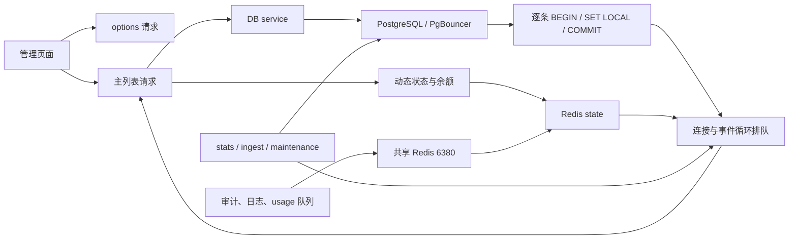

# 生产管理端卡顿根因与性能优先治理报告（2026-07-16）

## 1. 结论

- 本轮生产只读排障确认：管理页面和 System API 的主要延迟不在公网 IP、带宽、Caddy 或 Nginx，而在 PostgreSQL 请求放大、Redis 单线程头阻塞、后台统计与维护竞争，以及 Node.js 事件循环长时间停顿。
- 当前不是一个单点死锁问题。现场未观察到持续 PostgreSQL waiting lock；“平时正常、突然卡住”的原因，是普通查询固定事务开销、周期后台任务和共享 Redis 大消息在不同时间窗口叠加。
- 当前 PostgreSQL 普通 `query` / `execute` 会执行 `connect -> BEGIN -> SET LOCAL -> SQL -> COMMIT`。生产累计约 4950 万次 `BEGIN` / `COMMIT`，PgBouncer 历史平均实际 query 约 `4.3ms`，平均 transaction 约 `37.5ms`。
- Redis state 和 queue 在生产指向同一 `6380/db0`。审计队列曾出现约 `1.2MB` 单条 `XADD`，运行日志多次记录 `Redis XADD timed out after 1500ms` 和连接超时；队列命令会与 session、验证码、限流、并发槽和运行态读写竞争同一个 Redis 单线程。
- 最新 30 分钟事件循环样本显示：`server` 平均 lag `923.4ms`、P95 `2683.5ms`、最大 `3404.6ms`；`stats-worker` 平均 `892.2ms`、P95 `2561.0ms`、最大 `4483.0ms`；`db-service` 平均 `322.1ms`、P95 `802.2ms`、最大 `1185.4ms`。
- 方案必须只提速，不删减功能。账户、分组、API Key、路由策略、授权、统计、审计、日志、余额、运行状态和后台维护能力全部保留；允许改变的是执行时机、刷新方式、数据新鲜度和非核心记录的保留完整度。

## 2. 范围

- 分析对象：生产 `juhe-ai` 管理站点、Mac 生产主机的 server / db-service、PostgreSQL、PgBouncer、Redis 和三个 worker。
- 覆盖链路：登录后的管理接口、AI 账户列表与动态快照、供应商选项、分组、API Key、授权、策略路由、用量窗口、后台统计、记录队列和数据保留任务。
- 分析方法：真实账户请求、Nginx / DB service 日志对时、进程 CPU / RSS、事件循环采样、`pg_stat_statements`、`pg_stat_user_tables`、PgBouncer 统计、Redis INFO / SLOWLOG / commandstats，以及源码调用链核对。
- 本轮没有修改代码、配置或数据库，没有重启生产服务，没有执行写接口压力测试，也没有对真实上游模型进行付费压测。
- 发布期间的临时部署服务已排除；报告中的 temporary maintenance worker 是应用周期维护方式，不是发布残留。

## 3. 环境

| 项目 | 内容 |
| --- | --- |
| 日期 | 2026-07-16 |
| 生产拓扑 | Caddy -> Nginx `3099` -> server `3001` / DB service `3002` |
| 数据层 | PostgreSQL 18 + PgBouncer transaction pool |
| Redis | cache `6379`；state 与 queue 共享 `6380/db0` |
| 常驻进程 | server、db-service、ingest-worker、stats-worker、ops-worker |
| 源码工作区 | `F:\sub2api-lite` |
| 原始产物 | 在线只读采样，未新增仓库根目录机器产物；关键数值固化在本报告 |

## 4. 现场结果

### 4.1 管理接口

| 接口或链路 | 现场结果 |
| --- | --- |
| 个人 AI 账户列表 | 多轮平均约 `1.16s`，单次约 `2.16s`；生产日志出现 `3.99s` 到 `6.7s` |
| 供应商模型选项 | 多轮平均约 `1.50s`；生产日志出现约 `10s` 到 `15s` |
| 个人授权列表 | 平均约 `0.88s` |
| 个人账户用量 | 约 `0.61s` 到 `0.92s`，响应约 `184KB` |
| 个人 API Key / 路由策略 / 分组 | 多数约 `0.4s` 到 `0.8s`，存在随后台负载升高的长尾 |
| Nginx 转发 | `request_time` 基本等于 `upstream_response_time`，反向代理不是内部慢点 |
| server 无数据库请求 | 历史 20 次出现约 `0.07s` 到 `2.63s`，证明 server 事件循环本身会停顿 |

### 4.2 事件循环

| 进程角色 | 样本数 | 平均 lag | P95 lag | 最大 lag |
| --- | ---: | ---: | ---: | ---: |
| server | 41 | `923.4ms` | `2683.5ms` | `3404.6ms` |
| stats-worker | 60 | `892.2ms` | `2561.0ms` | `4483.0ms` |
| ingest-worker | 41 | `648.9ms` | `1533.6ms` | `2249.6ms` |
| db-service | 41 | `322.1ms` | `802.2ms` | `1185.4ms` |
| ops-worker | 41 | `79.2ms` | `154.1ms` | `240.7ms` |

整机 CPU 没有持续打满，但单个 Node.js 进程可以占满一个逻辑核心。管理端长尾主要是单进程事件循环饥饿和共享依赖排队，不是机器总带宽或总 CPU 容量不足。

### 4.3 PostgreSQL 与 PgBouncer

| 指标 | 结果 |
| --- | ---: |
| `BEGIN` 主调用组 | 约 `49,518,510` 次 |
| `COMMIT` 主调用组 | 约 `49,479,168` 次 |
| `SET LOCAL statement_timeout` 主调用组 | 约 `48,299,700` 次 |
| PgBouncer 历史平均 query time | 约 `4.32ms` |
| PgBouncer 历史平均 transaction time | 约 `37.51ms` |
| PgBouncer 累计等待时间 | 约 `10.5h` |

普通单条 SQL 被包装成显式事务后，需要多次客户端 / PgBouncer 往返。管理接口会执行多组 repository 查询，因此数据库没有锁等待时，接口仍会被事务往返、连接借用和 Promise 调度拖慢。

### 4.4 后台统计与维护

| 语句或任务 | 调用与耗时 |
| --- | --- |
| `usage_scope_range_windows` 写入 | `61,452` 次，总执行约 `106,525s`，平均 `1733.5ms`，最大 `28,161ms` |
| `usage_quota_hourly_windows` 写入 | `163,494` 次，总执行约 `56,165s`，平均 `343.5ms`，最大 `6689ms` |
| 审计孤儿 blob 候选查询 | `3044` 次，总执行约 `28,784s`，平均 `9456ms`，最大 `38,239ms` |
| 分组账户统计 | PostgreSQL 路径存在删除后逐行插入，每一行又经过普通查询事务包装 |
| 周期维护 | 使用记录和审计保留清理约每 10 分钟触发，容易形成周期性卡顿窗口 |

统计、审计和维护功能全部保留。需要改变的是刷新范围、写入粒度、事务数量和前台共享资源：全量重写改为 changed scope/date 增量、批量 SQL、低优先级预算和可中断小批任务。

### 4.5 Redis 头阻塞

- state 与 queue 共用同一 Redis 物理实例和 DB，Redis 单线程会依次执行状态命令、Lua、Stream 生产和消费命令。
- 现场 SLOWLOG / commandstats 包含 `EVAL`、`XREADGROUP`、`XADD`、`XAUTOCLAIM`；大 payload `XADD` 可占用数十毫秒。
- 审计、usage、operation log、public log、runtime log 和 record maintenance 队列会影响 session、验证码、限流、并发槽和调度运行态。
- 非核心队列失败不应升级为前台请求失败或主进程 fatal。队列过载时允许丢弃个别记录并计数，但记录页面、接口和消费链继续保留，恢复后继续工作。

## 5. 根因链

1. 页面请求列表、选项和动态快照。
2. 列表 DTO 同步等待并发、余额、用量、授权和其他装饰字段。
3. 每个 repository SQL 都被包装成独立事务。
4. stats / ingest / maintenance 同时制造大量 SQL、MVCC churn、autovacuum 和事件循环负载。
5. queue 与 state 共享 Redis，大 Stream 消息阻塞认证和运行态命令。
6. server / db-service 事件循环延迟后，所有轻接口一起出现秒级长尾。

## 6. 功能完整性边界

| 功能 | 是否保留 | 性能改造方式 |
| --- | --- | --- |
| AI 账户、分组、API Key、路由策略、授权 CRUD | 完整保留 | 普通 SQL 去事务，真实多表不变量保留最小事务 |
| 账户运行状态、并发、最近使用 | 完整保留 | 从主列表同步装饰改为动态快照补齐，保留最后成功值 |
| 余额 | 完整保留 | 使用缓存快照和独立刷新，不阻塞主列表 |
| 用量、趋势、TopN、额度 | 完整保留 | changed scope/date 增量窗口、批量 upsert、低频刷新 |
| 审计、运行日志、操作日志、公开接口日志 | 完整保留 | payload 引用化、限长、过载采样、超时丢弃个别记录 |
| 后台维护和数据保留 | 完整保留 | 单飞、低优先级、小批、jitter、禁止重叠 |
| 页面字段和操作按钮 | 完整保留 | 分阶段加载，不删字段、不删操作入口 |
| 错误可见性 | 完整保留 | 依赖失败显示不可用 / 过期状态，不返回假空数据 |

## 7. 目标方案

### 7.1 PostgreSQL

- 普通 `query` / `one` / 单条 `execute` 直接走 pool query，不自动开启事务。
- 只有真实多语句业务不变量、统计小批结果与游标共同推进等场景使用显式短事务。
- timeout 由数据库 role / database 默认值和客户端 deadline 提供；不为普通查询制造 `SET LOCAL` 事务。
- 统计写入改为单条批量 SQL、`INSERT ... SELECT ... ON CONFLICT` 或 changed scope/date 增量更新。
- worker 与 db-service 使用明确连接预算，避免多个进程的大 pool 同时冲击 PgBouncer。

### 7.2 Redis 与队列

- cache、state、queue 拆成三个物理 Redis 进程；不能只使用同一进程的不同 DB。
- state 使用独立低延迟连接；producer、consumer 和 blocking consumer 使用不同连接。
- 常规 Stream envelope 目标不超过 `32KB`；超过 `64KiB` 改为引用，最终 Stream 字段硬上限 `128KiB`。
- 非核心 producer 使用 best-effort：有界内存、短 deadline、断连 / 饱和 / 超时即丢并计数，不阻塞主请求、不触发进程 fatal。
- 功能入口和消费链保留；丢弃影响的是个别记录完整度，不是页面或能力是否存在。

### 7.3 管理 API 与前端

- 主列表只等待当前页稳定业务字段；动态状态、并发、用量、最近使用和余额通过独立快照补齐。
- provider / proxy options 与主列表并行，不能先 `await options` 再发起列表。
- 快照首轮在主列表成功后触发；成功态保持现有 `10s +/- 1s` 节奏，隐藏页停止，连续失败按 `20s -> 40s -> 80s -> 120s` 退避。
- 前端保留最后一次成功快照；失败时标记字段过期 / 不可用，不清空列表或伪造 `0`。
- Server-Timing 至少拆分 `db-queue`、`repo-base`、`db-exec`、`serialize` 和 `total`。

## 8. 分阶段实施顺序

1. 建立性能基线和功能完整性回归矩阵。
2. 生产先拆 queue Redis，验证 state 延迟和接口长尾变化。
3. 移除普通 PostgreSQL 查询的自动事务包装。
4. 前端解除 options 对主列表的串行阻塞。
5. 主列表移除同步动态装饰，统一由动态快照补齐。
6. 队列 payload 引用化、限长和 best-effort producer 落地。
7. 统计窗口、额度窗口和分组统计改增量 / 批量写。
8. 维护任务改为低优先级、禁止重叠和更长周期。
9. 完成生产 15 分钟持续压测和功能逐项回归后再关闭计划。

每一步独立发布、独立验证、可独立回退；禁止把所有改动合并成一次高风险大发布。

## 9. 验收指标

| 指标 | 目标 |
| --- | --- |
| 管理主列表 P50 | `<= 200ms` |
| 管理主列表 P95 | `<= 300ms` |
| 管理主列表 P99 | `<= 800ms` |
| options P95 | `<= 300ms`，且不阻塞主列表发起 |
| 动态快照 P95 | `<= 500ms`；失败不清空已有数据 |
| server 事件循环 lag P95 | `<= 200ms` |
| db-service 事件循环 lag P95 | `<= 100ms` |
| DB service queue wait P95 | `<= 50ms` |
| 普通独立 SQL 自动 BEGIN / COMMIT | `0` |
| PgBouncer 平均 transaction time | `< 10ms` |
| state Redis 命令 P99 | `< 5ms` |
| Stream 消息 | 常规 `<=32KB`，最终字段硬上限 `128KiB` |
| 非核心副作用本地提交 P99 | `< 1ms` |
| 功能回归 | 页面、字段、操作、统计、审计和网关主流程无删减 |

## 10. 风险与回退

- 动态快照可能短暂显示旧值。页面必须展示生成时间或不可用状态，不能把旧值包装成实时事实。
- 非核心记录在 Redis 断连、队列饱和和 payload 超限时可能丢失。这是明确接受的性能取舍，但丢弃数量必须可观测。
- 去除普通查询事务后，需要识别真实多语句业务不变量并保留最小事务；不得机械删除显式 `transaction()`。
- 统计窗口改为增量后，必须保留离线全量重建入口，不在 API 请求链路自动补算。
- 每个阶段回退使用上一已验证发布包和对应配置；不在运行时代码增加旧结构兼容、双写或自动迁移。

## 11. 关联文档

- 总计划：`docs/plans/计划-0120-生产管理端性能优先治理.md`
- PostgreSQL 子计划：`docs/plans/计划-0121-PostgreSQL去事务与统计降载.md`
- Redis / worker 子计划：`docs/plans/计划-0122-Redis队列隔离与后台任务降载.md`
- 管理接口子计划：`docs/plans/计划-0123-管理接口渐进加载与事件循环治理.md`
- 历史管理读写隔离：`docs/plans/计划-0076-管理接口读写隔离与前台防阻塞.md`
- 历史 DTO 分层：`docs/plans/计划-0077-管理接口DTO分层与渐进式加载.md`
- 历史统计隔离：`docs/plans/计划-0079-可靠统计与读写资源隔离.md`
- 历史生产报告：`docs/reports/生产管理端接口性能压测报告-2026-07-05.md`
- 审计清理问题：`docs/bug/问题-0034-审计保留清理单批删除长尾.md`
