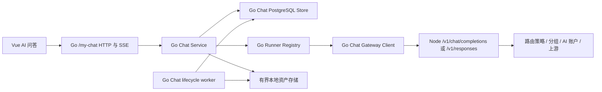

# AI 问答 Go 无缝接管设计

> 实施顺序：设计已确认。按 2026-07-18 用户指令，AI Chat 排在整体 Node 转 Go 迁移的最后阶段；`master` 仍持续改造 Chat 期间只维护本设计和契约漂移审计，不编写实施计划、不开始 Go Chat 代码。待其他迁移与生产切流门禁完成、Chat 契约稳定后再进入实施。

## 1. 背景与决策

AI 问答当前由 Node 后端完整承载，会话状态、消息、幂等轮次、生成 runner、SSE 订阅与重连、上下文 checkpoint / 压缩、图片资产和后台清理均属于同一个 Chat owner。项目整体迁移策略是先保留 Node，在 Go 功能、稳定性和真实环境证据完整后再按对照清单删除 Node；不在迁移过程中提前保留永久双实现。

本设计确认第一阶段采用以下边界：

- Go 完整接管 `/__aisys__/api/my-chat/*` 的 Chat 业务与状态。
- Go 使用会话绑定的真实本地 API Key，经受限 loopback HTTP 调用 Node `/v1/chat/completions` 或 `/v1/responses`。
- Node 暂时继续负责网关鉴权、路由策略、分组与账户调度、代理、额度、并发、计费、使用记录和原始审计。
- Go 网关完成并稳定后，Chat 的内部网关客户端改为调用 Go 网关，再删除 Node `/v1/*` owner。
- `/my-chat` 只允许单一 owner，禁止按接口、请求、用户或会话随机分流到 Node 和 Go。

## 2. 目标与非目标

### 2.1 目标

- 保持现有前端 HTTP DTO、错误码、SSE 事件和恢复语义不变。
- 将 Chat 的 PostgreSQL 存储、业务服务、生成生命周期、资产、上下文和后台清理完整迁入 Go。
- 通过短事务和有界内存结构保持现有容量与性能底线。
- 提供可验证的 drain、切流、回滚和 Node 减法删除门禁。
- 每个迁移切片均可独立测试和提交；未到切流阶段前不改变生产 owner。

### 2.2 非目标

- 第一阶段不迁移通用 `/v1/*` 网关实现。
- 不让 Go 直接访问供应商 Base URL，不复制第二套路由、调度、额度或计费逻辑。
- 不新增双写、双读、运行时旧 schema 兼容或长期 Node / Go 混合 owner。
- 不把 Chat 正文放入 Redis，也不把前台生成提交到 Asynq。
- 不新增文件附件、知识库、MCP、Skill、站内工具执行或跨会话长期记忆。

## 3. 方案选择

### 3.1 采用方案：分阶段实现，整体切换 owner

Go 先在未挂载生产路由的状态下完成存储、服务、runner、SSE、网关桥接、资产、上下文和 worker。全部门禁通过后，排空 Node 活动生成并一次性切换整个 `/my-chat` owner。

该方案允许小块提交和独立验证，同时避免 Node 进程内 runner registry 无法被 Go 的 stop / attach 路由访问。

### 3.2 不采用：按接口渐进切换

发送、停止、重连、submission 对账和 stale recovery 共享活动轮次状态。若分别属于 Node / Go，会出现停止失效、重连找不到 runner、重复恢复和错误终态，因此不允许按接口切换。

### 3.3 不采用：一次性重写后直接切流

该方案把 schema、事务、SSE、网关、资产、上下文和切流同时放入一个变更，无法提供足够细的回归证据和可靠回滚点。

## 4. 总体架构



依赖方向固定为：

```text
httpapi
  -> chat.Service
      -> port.ChatStore
      -> port.ChatContextStore
      -> port.ChatAssetStore
      -> chatgateway.Client
      -> RunnerRegistry
      -> AssetObjectStore
      -> Clock / IDGenerator
```

- HTTP 层只负责认证上下文、参数解析、DTO、SSE 写出和错误映射。
- service 不依赖 `pgx`、sqlc 类型、Redis 或 `http.ResponseWriter`。
- PostgreSQL store 实现事务、锁、CAS、游标分页和 owner 条件。
- runner registry 只保存当前 Go 进程内活动生成，不作为事实源。
- PostgreSQL 是轮次、消息、终态和恢复状态的唯一权威来源。

Chat runtime owner 另使用 PostgreSQL 单例控制行和专用连接持有的 advisory lock 实现 fail-closed 互斥：

- 控制行保存 `owner = node | go`、单调递增 `generation` 和更新时间。
- Node 与 Go 启动 Chat HTTP 写入、runner 或 lifecycle worker 前，必须以专用 PostgreSQL 连接获得同一个 session-level advisory lock，并确认配置 owner 与控制行一致。
- 专用连接丢失时 advisory lock 自动释放，进程立即撤销 Chat readiness、停止接受新轮次并取消 worker claim；不能继续按本地缓存 owner 运行。
- 每个接受的 turn 和后台 claim 记录当前 `owner_generation`，后续写入必须同时匹配 turn、状态和 generation，旧 owner 的迟到写入无法越过 fencing。
- 反向代理 owner 与 runtime owner 是两个明确门禁：只有新 runtime owner 获锁并 ready 后才允许更新代理；旧代理在短暂切换窗口命中已 drain owner 时明确返回不可用，不回退执行写入。

## 5. 存储设计

Goose migration 必须精确投影当前 Node PostgreSQL Chat 契约，并显式创建 `juhe_chat` schema。核心表为：

- `chat_conversations`：会话、API Key 绑定、最近模型、消息 revision、活动 turn 和稳定排序字段。
- `chat_messages`：用户 / assistant 消息、sequence、状态、内容块、usage、错误与生成元数据。
- `chat_message_idempotency`：`system_account_id + conversation_id + client_message_id` 幂等事实。
- `chat_user_storage_windows`：用户正文保留窗口和容量锁。
- `chat_user_asset_usage`：用户资产容量锁。
- `chat_context_checkpoints`：压缩 checkpoint、状态、claim 和重试信息。
- `chat_context_entries`：checkpoint 后的有序上下文条目。
- `chat_assets`：资产 owner、会话、状态、文件元数据、引用与清理 claim。
- `chat_runtime_ownership`：Chat owner、generation 和切流审计时间；配合固定 advisory lock key，不保存正文或 runner 状态。

约束：

- 所有会话、消息、资产和幂等查询都必须显式包含 `system_account_id`。
- 接受轮次必须在一个短事务内完成配额锁、幂等占位、用户消息、assistant 占位、sequence、revision 和 `active_turn_id` CAS。
- 同一会话只允许一个活动 turn。
- 终结轮次只能由匹配 `active_turn_id` 的条件更新完成。
- turn 接受、runner 持久化和 worker claim 必须匹配当前 `owner_generation`。
- completed / failed / canceled 是终态，重复终结不得覆盖已有终态。
- 请求路径不得扫描全部消息、资产或用户历史后在内存聚合容量。
- 消息使用稳定 sequence 游标分页；不使用 offset 扫描完整会话。

历史 migration 不修改；Chat baseline 使用当前最新顺序之后的新 migration。

## 6. HTTP 契约

前缀保持 `/__aisys__/api/my-chat`，普通响应保持 `{ "data": ... }`，认证继续使用现有登录 Cookie。接口完整迁移如下：

- `GET /conversations`
- `POST /conversations`
- `GET /conversations/{id}`
- `PATCH /conversations/{id}`
- `DELETE /conversations/{id}`
- `GET /conversations/{id}/messages`
- `GET /conversations/{id}/sync`
- `GET /conversations/{id}/submissions/{clientMessageId}`
- `GET /conversations/{id}/models`
- `GET /conversations/{id}/context-status`
- `POST /conversations/{id}/assets`
- `GET /conversations/{id}/assets/{assetId}/content`
- `DELETE /conversations/{id}/assets/{assetId}`
- `POST /conversations/{id}/stream`
- `GET /conversations/{id}/streams/{turnId}`
- `POST /conversations/{id}/stop`
- `GET /api-keys`

路径参数必须按单个 segment 编码。消息游标 `beforeSequenceNo`、`afterSequenceNo`、`fromSequenceNo` 保持互斥；会话列表继续使用 pinned / last-message / id 复合游标。

发送请求保持：

```json
{
  "clientMessageId": "client-generated-id",
  "replaceTurnId": "optional-turn-id",
  "content": "text fallback",
  "contentBlocks": [
    { "type": "input_text", "text": "hello" },
    { "type": "input_image", "assetId": "asset-id" }
  ],
  "model": "model-id",
  "reasoningEffort": "optional-effort",
  "serviceTier": "optional-tier"
}
```

完整错误契约不以本节列举项为上限。实施前从现有 Node route / repository / runner contract regression 生成 golden matrix，逐接口固定 HTTP 状态、错误码、响应 envelope、DTO 字段、SSE payload 和消息终态；Go contract test 必须逐项通过。以下仅为生成与恢复链路的关键错误码示例：

- `auth_required`
- `chat_replace_conflict`
- `chat_turn_limit_exceeded`
- `chat_message_already_exists`
- `chat_stream_terminal`
- `chat_stream_runner_missing`

## 7. 生成与 SSE

### 7.1 runner 生命周期

- HTTP stream 请求完成轮次原子接受后，使用应用根生命周期创建 runner context。
- runner context 不得派生自发起请求的 context。
- 浏览器断开只取消该 subscriber，不取消后台生成。
- stop 通过 registry 请求取消 runner，并以 PostgreSQL 条件终结保证进程重启后的确定结果。
- 应用关闭时先停止接受新轮次，再有界等待活动 runner，超时后取消并持久化可恢复状态。

### 7.2 subscriber

- 每个 subscriber 使用固定容量 channel。
- 发布事件不得被任一慢 subscriber 阻塞。
- 队列满时关闭该 subscriber，让客户端进入 attach / sync 恢复。
- registry 不保存无界事件历史；重连权威快照来自 PostgreSQL。

### 7.3 SSE 事件

保持以下具名事件：

- `message.started`
- `message.snapshot`
- `message.delta`
- `reasoning.delta`
- `tool.started`
- `tool.updated`
- `tool.completed`
- `message.completed`
- `message.failed`
- `message.canceled`

`message.started` 返回 `turnId`、用户消息和 assistant 占位消息。其后事件携带单调递增、非负安全整数 `eventVersion`。attach 使用版本屏障避免快照与订阅之间丢事件：先在 registry 注册有界 subscriber，再读取包含当前 `eventVersion` 的 PostgreSQL 权威快照并发送 `message.snapshot`，随后只转发队列中 `eventVersion` 大于快照版本的事件；不高于快照版本的事件作为已被快照覆盖的重复事件丢弃。若注册后 runner 已终结或 registry 不存在，则重新读取 PostgreSQL 终态快照并直接回放终态，不把 `runner missing` 当作消息不存在。SSE 支持注释心跳、CRLF / LF 分隔和 UTF-8 分块，不把单个 TCP read 当作完整事件。

### 7.4 对账与恢复

- submission 状态保持 `preparing | not_found | accepted`。
- `accepted` 返回 turn、assistant message 和当前状态。
- `sync` 返回单调 `messageRevision`、`lastSequenceNo`、`activeTurn`、`tail`、`unchanged` 和 `serverTime`。
- stale recovery 只由持有当前 owner lock / generation 的 Chat owner 执行，并遵守 at-most-once 上游调用状态机：接受轮次后初始为 `dispatch_pending`；runner 在任何网络写入前先以 generation 条件写入 `gateway_dispatch_started_at` 和唯一 attempt ID，再发起 Node 网关请求。失去 runner 且已有 `gateway_dispatch_started_at` 的轮次一律条件终结为可展示失败，不自动重发，因为无法证明上游未接收；只有仍为 `dispatch_pending`、没有 dispatch marker 且 generation fencing 成功的轮次允许新 owner 调度。该规则宁可在极小窗口内失败，也不以重复计费换取自动续跑。
- 单次 `not_found` 不改变前端既有 grace / 连续确认策略。

## 8. Node 网关桥接

Go `chatgateway.Client` 使用专用 `http.Transport`：

- 目标只允许配置的 loopback IP 和显式端口。
- 禁止环境代理和 HTTP 重定向。
- 设置连接池上限、连接超时、TLS / 响应头超时和流空闲超时。
- 不设置覆盖完整 SSE 生命周期的 `http.Client.Timeout`。
- 限制响应头和单个 SSE event / JSON payload 大小。
- 使用会话绑定 API Key 的当前完整密钥发送 `Authorization: Bearer ...`。
- 完整密钥只在服务端短暂内存中存在，不进入响应、日志或错误。

协议选择继续以当前模型能力和候选实际 endpoint mode 为准：普通 Chat 调用 `/v1/chat/completions`，Responses / 原生工具调用 `/v1/responses`。Go Chat 不自行判定路由可用性；Node 网关仍是最终裁决者。

## 9. 上下文与资产

### 9.1 上下文

- 保持 checkpoint + recent suffix、软水位异步压缩和硬水位发送前压缩。
- 压缩任务使用同一受限 Node 网关客户端，不直接调用供应商。
- claim、重试、退避和终态写入 PostgreSQL；同一 checkpoint 只允许一个 owner 处理。
- token / JSON 字节预算和上游 SSE event 预算必须有明确上限。

### 9.2 资产

- multipart 字段名保持 `file`。
- Node 与 Go 共存及回滚期使用同一个显式配置的 Chat 资产持久卷根目录；启动时必须验证根目录标识、读写权限和可用空间，缺失时 Chat readiness 失败。
- Go 保持 Node 当前 `storageKey` 生成和相对路径格式，数据库只保存相对 key，不保存进程专属绝对路径。
- 上传先在同一文件系统写入不可见临时文件，完成大小 / MIME / 图像尺寸和内容摘要校验并 `fsync` 后原子 rename 到最终 key；数据库 ready 状态只在 rename 成功后提交。
- Node 与 Go 对同一资产执行内容摘要、byte size 和元数据一致性校验；切流前执行旧 Node 资产由 Go 读取、Go 新资产由 Node 读取的双向 cross-read。
- 上传完成前资产不能被发送引用。
- 资产路径由服务端生成，禁止用户输入形成路径穿越。
- 读取时同时校验 system account、conversation 和 asset owner。
- 删除草稿资产、会话级联和保留期清理由当前 Chat owner 执行。
- 文件读取、响应和清理均使用 stream / 分块，不把完整大文件读入内存。
- 资产卷纳入现有备份 / 恢复流程；回滚演练必须验证数据库快照与资产卷快照属于同一恢复点。

## 10. 后台 worker 单 owner

Go Chat lifecycle worker 负责：

- stale preparing / streaming turn 恢复。
- 上下文 checkpoint 压缩 claim 与重试。
- 过期消息、幂等记录、上下文条目和资产清理。
- PostgreSQL 消息分区维护。

Node 与 Go 共存期间只有持有 PostgreSQL Chat advisory lock 且 generation 匹配的 runtime owner 可以启动这些任务。切流流程必须先 drain 并停止旧 owner 的 worker、释放专用 lock，再推进 owner generation 并由新 owner 获锁；禁止两个进程同时恢复或清理同一 Chat 数据。

## 11. 实施切片

### 11.1 存储基线

- 新增 Chat Goose migration、port、sqlc query、PostgreSQL store。
- 覆盖会话 CRUD、消息分页、幂等、配额锁、轮次接受 / 终结、owner 隔离和并发。
- 不注册 HTTP 路由，不改变生产行为。

### 11.2 会话、模型与只读 HTTP

- 实现普通 CRUD、messages、sync、submission、models、context-status 和 API Key options。
- 路由保持 opt-in 且不进入生产反向代理。

### 11.3 runner、SSE 与 Node 网关桥接

- 实现 registry、subscriber、stream / attach / stop、Chat / Responses SSE parser 和受限 gateway client。
- 文本单轮必须作为完整垂直切片验证，发送、attach 和 stop 不拆分 owner。

### 11.4 资产、上下文与生命周期 worker

- 实现 multipart 资产、内容读取、删除、checkpoint、压缩、stale recovery、retention 和分区维护。

### 11.5 整体切流

- 执行 drain、owner 互斥、真实前端和回滚演练。
- 一次性将 `/my-chat` 全部路径切到 Go。

## 12. 切流与回滚

### 12.1 切流前门禁

- Node 不再接受新 Chat 轮次。
- Node `preparing` 数为 `0`。
- Node runner registry 活动 runner 数为 `0`。
- PostgreSQL 所有 Chat conversation 的 `active_turn_id IS NULL`。
- Node stale recovery、compaction、asset cleanup 和 retention 已停止。
- Node 已释放 Chat advisory lock，控制行 owner / generation 切换过程已有审计记录。
- Go schema、store、SSE、Node gateway E2E、前端桌面 / 移动端和进程重启恢复测试全部通过。
- Node / Go 已通过会话、消息、metadata、context、资产状态和终态的双向 cross-read；Node 删除前 Go 不写入 Node 无法理解的新枚举或结构。
- 共享资产卷的根目录标识、权限、空间、抽样摘要和备份恢复检查全部通过。
- 反向代理 owner manifest 明确 `/my-chat -> Go`，Node 与 Go 启动配置互斥。

### 12.2 切流步骤

1. 将 Node Chat 置为 drain 状态并拒绝新轮次。
2. 等待活动 runner 和 preparing 清零。
3. 停止 Node Chat lifecycle worker并释放 Chat advisory lock。
4. 在 PostgreSQL 事务中把 owner 更新为 Go 并递增 generation。
5. Go 使用专用连接获得 advisory lock，确认 generation 后启动 Chat HTTP / worker 并通过 readiness。
6. 原子更新 `/my-chat` 反向代理 owner。
7. 运行真实 HTTP、SSE、浏览器、资产 cross-read 和断线恢复 smoke。

### 12.3 回滚

1. Go Chat 进入 drain，拒绝新轮次。
2. 等待 Go runner 和 `active_turn_id` 清零。
3. 停止 Go Chat worker并释放 Chat advisory lock。
4. 在 PostgreSQL 事务中把 owner 更新为 Node 并递增 generation。
5. Node 获得 advisory lock，确认 generation 和双向 cross-read 后启动 Chat HTTP / worker。
6. 原子把 `/my-chat` owner 切回 Node。
7. 运行同一套 smoke并核对 revision、submission、消息终态和共享资产。

不得在有活动 runner 时直接切换 owner。

## 13. 验证矩阵

### 13.1 非容器验证

- migration catalog、sqlc generate / diff、store / service / HTTP 单元测试。
- `go test -race` 覆盖 registry、subscriber、stop 和 shutdown。
- SSE parser 覆盖 CRLF / LF、UTF-8 分块、超大 event、畸形 JSON 和终态。
- Node Chat 契约回归和前端 Chat API / generation runtime 回归继续作为对照。
- 由 Node 当前 contract regression 导出的完整 golden matrix 必须覆盖每条路由的成功 / 错误 HTTP 状态、错误码、DTO、SSE 事件和终态；禁止只验证关键错误码子集。

### 13.2 真实依赖验证

- fresh PostgreSQL 全量 migration。
- 相同 `clientMessageId` 并发幂等。
- 用户会话数、轮次数、正文容量和资产容量并发锁。
- 接受轮次中途失败事务回滚。
- runner 脱离 request context。
- advisory lock 断连后 readiness fail-closed、owner generation fencing 和旧 owner 迟到写入拒绝。
- subscriber 慢消费、断线 attach、stop、终态回放和进程重启 stale recovery。
- attach 注册与 snapshot 并发发布时不丢 event，且重复 eventVersion 被过滤。
- `dispatch_pending` 可恢复、已有 dispatch marker 不重发的 at-most-once 崩溃矩阵。
- Go Chat 携带真实本地 API Key，经 Node `/v1/*` 完成 Chat / Responses SSE。
- 上下文压缩、图片上传 / 发送 / 删除和保留期清理。
- Node 写入 -> Go 读取和 Go 写入 -> Node 读取的消息 / context / 资产双向 cross-read。

### 13.3 前端真实验证

- 真实 Go listener、PostgreSQL、Redis、Node gateway 和登录 Cookie。
- 创建会话、模型加载、发送、started / snapshot / delta / completed。
- 主动断开后 attach 恢复，随后用 submission / sync / messages 对账。
- stop 后确定 canceled 状态。
- 桌面和小于 `820px` 移动视口。
- 图片上传、预览、发送、草稿删除和会话切换。

## 14. Node 减法删除条件

只有以下条件全部满足，才进入 Node Chat 删除：

- `/my-chat` 已由 Go 单 owner 稳定运行并完成回滚演练。
- Node / Go 契约差异清单为零。
- 真实 PostgreSQL、SSE、浏览器和 worker 证据完整。
- 生产包包含 Go binary、migration、worker 和 owner 配置。
- 监控、日志、readiness 和告警可区分 Chat store、runner、gateway bridge 和 worker 故障。

删除顺序：先删除 Node `/my-chat` 路由装配，再删除 Node Chat runner / service / repository / worker，最后在 Go 网关稳定后删除 Node `/v1/*` 网关。每一轮删除后运行对应 Node absence gate、Go 全量测试和真实 smoke，不保留失去 owner 的兼容代码。
