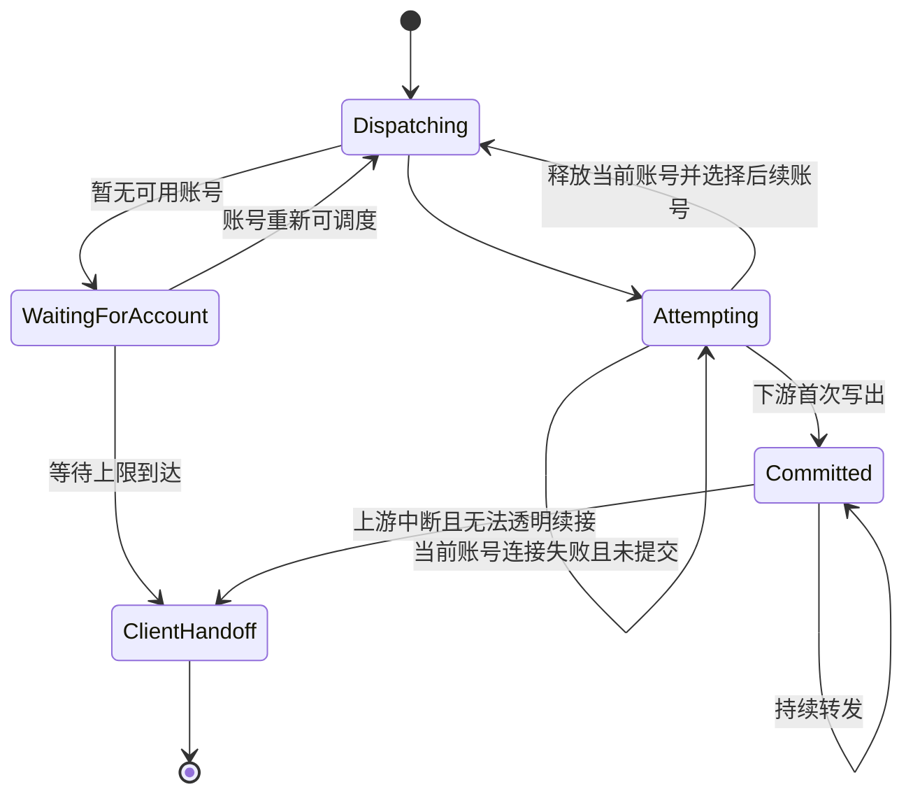

# 网关长会话与生图服务端接管设计

## 1. 背景与问题

当前网关默认使用四个相关设置：

- `textFirstResponseTimeoutSeconds = 120`：文本 lane 上游首个响应和非流式首字节等待上限。
- `textStreamIdleTimeoutSeconds = 30`：文本 lane 流式上游连续没有 raw chunk 的停顿上限。
- `noAvailableAccountWaitTimeoutSeconds = 270`：没有可派发或可恢复账号时的客户端接管等待上限。
- `textUncommittedAttemptMaxLifetimeSeconds = 1800`：文本 lane 单次未提交尝试的最大存活时间。

图像请求已经能够通过 `/images/*`、`gpt-image-*`、`dall-e-*` 和 Responses `image_generation` 工具识别为 `image` lane，但当前 lane 只影响权限、并发和账号排序，不影响超时与服务端接管边界。复杂图像生成可能需要接近两分钟，跨协议图像 provider 还存在独立的 120 秒超时，因此合法的长耗时请求可能在服务端仍有可用账号时被提前交给客户端。

本设计以项目稳定性规范为最高约束：

1. 只要还有可用账号，服务端尽量维持客户端连接并继续救回请求。
2. 不依赖上游状态码、错误类型、错误文案或错误 JSON 判断是否切号；除非已经明确识别出具体客户端并且现有客户端策略允许使用协议专属语义。
3. 下游尚未提交响应时优先服务端重试；下游已经提交后不透明拼接第二个账号的响应，交由客户端重试。
4. 服务端无法继续接管时才使用客户端可重试失败语义，不伪造上游成功。

## 2. 目标与非目标

### 2.1 目标

- 将当前请求的“首包、流式停顿、单次尝试寿命、无账号等待”四种时间语义分开。
- 为 `text` 和 `image` lane 提供独立 timeout profile。
- 在下游提交前统一管理上游失败、超时、EOF 和账号切换，避免 270 秒无条件截断仍可救回的请求。
- 保持通用客户端不依赖上游错误语义；已识别的 Codex、Claude Code、Gemini CLI 行为继续由客户端画像策略隔离。
- 对 Images API、Responses 图像工具和跨协议图像 provider 保持原始请求语义，避免重复生成、半截 JSON 和 SSE 拼接污染。
- 增加可验证的 transport、pre-commit、image lane 和长会话回归覆盖。

### 2.2 非目标

- 不新增上游状态码、错误码、错误文案白名单。
- 不把自然语言 prompt 作为生图识别依据。
- 不在本期实现 Responses `background=true` 的跨请求账号持久绑定和断线续流。
- 不把图像超时策略写入 API Key、路由策略、分组或普通账户配置；它属于系统级网关运行策略。
- 不为已向客户端提交的半截 JSON 或半段 SSE 自动拼接另一个账号的响应。

## 3. 核心模型

### 3.1 请求 lane

请求进入 preflight 后得到最终 `requestLane`：

- `text`：普通文本和没有结构化图像工具的请求。
- `image`：`/v1/images/*`、`gpt-image-*`、`dall-e-*`、Responses `tools[].type = image_generation` 或强制图像 `tool_choice`。

识别只读取客户端请求路径、模型和有限 JSON 元数据，不读取上游响应状态或正文。图像权限降级移除 optional 图像工具后，lane 重新回到 `text`；强制图像请求在权限关闭时拒绝。

### 3.2 timeout profile

新增内部 `GatewayTimeoutProfile`，不把图像数值直接覆盖到 `GatewaySettings`：

```ts
interface GatewayTimeoutProfile {
  firstResponseTimeoutMs: number
  firstByteTimeoutMs: number
  idleTimeoutMs: number
  uncommittedAttemptMaxLifetimeMs: number
  noAvailableAccountWaitMs: number
}
```

推荐默认值：

| Profile | 首响应 / 首字节 | 流式停顿 | 未提交单次尝试寿命 | 无账号等待 |
| --- | ---: | ---: | ---: | ---: |
| `text` | 120 秒 | 30 秒 | 1800 秒 | 270 秒 |
| `image` | 600 秒 | 120 秒 | 3600 秒 | 270 秒 |

`noAvailableAccountWaitMs` 只在没有可用账号时生效。只要调度层仍能提供候选账号，不能因为该值到期而停止服务端尝试。系统设置直接使用语义准确的新名称：

- `textFirstResponseTimeoutSeconds = 120`
- `textStreamIdleTimeoutSeconds = 30`
- `textUncommittedAttemptMaxLifetimeSeconds = 1800`
- `imageFirstResponseTimeoutSeconds = 600`
- `imageStreamIdleTimeoutSeconds = 120`
- `imageUncommittedAttemptMaxLifetimeSeconds = 3600`
- `noAvailableAccountWaitTimeoutSeconds = 270`

不保留旧的 `streamRequestTimeoutSeconds`、`streamIdleTimeoutSeconds`、`streamClientTotalWaitTimeoutSeconds` 和 `streamMaxLifetimeSeconds` 设置名，也不在运行时代码中做旧字段兼容。

### 3.3 downstream commit

请求维护 `transportCommitted`、`semanticCommitted` 和 `downstreamBytesWritten`：

- `transportCommitted = false`：HTTP 响应头和正文都尚未写出，仍然可以在失败后返回协议原生 HTTP 错误或透明切换账号。
- `transportCommitted = true, semanticCommitted = false`：SSE 注释心跳或空的传输保活已经写出，不能再返回 HTTP `503`，但仍可在同一 SSE 连接中切换账号；失败时只能写客户端画像允许的 SSE 失败事件或断流。
- `semanticCommitted = true`：已经写出真实协议事件、正文或可见输出，不能把第二个账号的完整响应拼接到当前响应。

状态判断不依赖上游 HTTP 状态码、错误类型或错误体，只依赖网关自身的写出边界。上游 MIME 只用于选择传输解码和 SSE / JSON 管道，不参与重试或账号状态判断。

## 4. 服务端接管状态机



### 4.1 未提交阶段

- 连接失败、首响应超时、首字节超时、上游 EOF 或读取异常都统一视为当前尝试失败。
- 释放当前账号并从现有候选账号或后续可承接分组继续选择。
- 不检查上游状态码，不检查错误体，不为某种错误文案增加特殊分支。
- 原始请求体、客户端请求头和请求 lane 保持不变；只有账号、上游 URL 和尝试审计索引变化。
- 候选账号暂时全部不可用时进入已有恢复等待窗口；SSE 请求可以发送注释心跳保持连接，非流式请求不能写入非法 JSON 心跳。

SSE 请求在进入候选等待前可以先准备并提交 SSE 传输头，此时置 `transportCommitted=true`、`semanticCommitted=false`；随后只能发送注释心跳，不能返回 HTTP JSON 错误。非 SSE 请求在未提交阶段不发送任何心跳，以保留 HTTP 透明切换和协议原生错误的可能。

候选账号维护本次请求内的尝试集合：同一轮内不立即重复刚刚失败的账号；候选全部尝试过后，如果本地运行态显示有账号将在恢复窗口内重新可调度，则等待账号可用性变化后开启下一轮；没有可恢复账号时才进入客户端接管倒计时。这样既不会在有可用账号时提前结束，也不会在同一个问题账号上无限自旋。

### 4.2 已提交阶段

- 继续转发当前账号，尊重客户端断开和流式 raw chunk 停顿边界。
- `transportCommitted = true, semanticCommitted = false` 时，可以在同一 SSE 连接中切换账号，但只能继续写 SSE 帧，不能退回 HTTP JSON 错误。
- `semanticCommitted = true` 时不把另一个账号的响应追加到已提交响应。
- 对明确识别的客户端使用现有协议失败事件；通用客户端使用现有协议原生失败 / 断流语义，让客户端重试。
- 已提交阶段不因为上游状态码、错误体或模型返回字段追加新的账号判断。

### 4.3 270 秒语义调整

`noAvailableAccountWaitTimeoutSeconds` 是无可用账号时的客户端接管等待上限。当前候选仍可调度时不使用该值阻断服务端救回。等待预算只累计 `dispatchableNow=false` 且存在 `recoverableLater` 或正在确认运行态变化的时间；一次上游尝试消耗的时间不计入该预算。已有客户端画像和协议最终失败入口保留，不改变对外错误结构。

### 4.4 普通路由速度优先边界

普通路由 `speed_first` 只对最终 `requestLane = text` 生效。`image` lane 不记录速度优先慢样本、不写入 `latency_degraded`，也不在 `firstByteThresholdMs` 到达时执行确认慢切号；图像只使用本设计的 image timeout profile 和未提交 transport 失败接管，避免合法长耗时生成被软阈值取消后在另一个账号重复计费。

文本 lane 保持现有软观察、慢样本确认、同分组候选、`maxFirstByteRetriesPerRequest`、目标账号并发槽预占和共享切换预算。270 秒不再按整次请求墙钟阻断文本快速切号：当前账号仍在执行或目标账号可以立即预占时继续现有请求；只有零可派发账号阶段才累计无账号等待预算。

SSE 只写入网关注释心跳时，快速模式看 `semanticCommitted` 而不是 `res.headersSent`，因此仍可在同一 SSE 传输内切换未提交语义的账号。快速模式恢复样本只描述首输出延迟，不使用 `upstreamResponse.ok`、状态码或错误体作为恢复条件。

## 5. 非流式响应策略

### 5.1 普通小响应

继续使用现有流式 / 非流式管道，但在第一次下游写出前保留有限预提交窗口。首字节前发生 transport 失败时，当前请求可以换账号。

### 5.2 图像 JSON 响应

Images API 非流式响应的首字节仍是提交边界：

1. 图像生成阶段没有首字节时使用 `imageFirstResponseTimeoutSeconds`，未提交失败可以切换账号。
2. 首字节写出后按现有分块转发，不为了隐式重试把完整 Base64 JSON 读入内存。
3. 正文中途失败时记录 transport / body interruption，并交给客户端重试；不能拼接第二个账号的半截 JSON。
4. 审计和诊断捕获继续使用现有明确上限，不把图像正文扩散到无界内存路径。

## 6. 流式响应策略

- `image` lane 使用 120 秒 raw chunk 停顿上限；`text` lane 保持 30 秒。
- 未提交前允许关闭当前上游并切换账号；已有 pre-commit buffer 需要清空。
- SSE 等待账号期间只发送注释心跳，不发送伪造的模型事件、成功事件或错误事件。心跳提交传输层但不提交语义层；如果最终没有账号，只能结束 SSE 或发送明确客户端允许的失败事件，不能再写新的 HTTP 状态码。
- 已提交后只继续当前上游；无法续接时按客户端画像和下游协议结束，不能把新账号流接在旧流后面。
- 已提交且持续有上游数据的长会话不因固定 1800 秒机械中断；绝对寿命只保护未提交的单次尝试。客户端断开、无数据停顿或服务关闭仍是收口条件。

## 7. 跨协议图像 provider

`JUHE_AI_IMAGE_GENERATION_PROVIDER_TIMEOUT_MS` 与 `image` timeout profile 对齐：默认 600 秒，最大 900 秒。executor 已支持 `AbortSignal`，但 Anthropic bridge 的 Responses 图像 JSON / SSE 转换入口必须把当前请求 signal 继续传给 `generate` / `generateStream`；本期补充这一传递和长超时回归，不重复实现第二套取消机制。

provider 返回内容只在 adapter 内按已声明协议解析，不把 provider 状态码、错误类型或错误文案上升为通用网关重试规则。未提交阶段的 transport / timeout 仍由服务端尝试控制器接管。

Responses `background=true` 本期不自动启用。它需要 response id 到账号的跨请求持久绑定，且跨协议 bridge 当前不能等价承接；后续独立设计。

## 8. 配置与文档

新增系统设置：

- `textFirstResponseTimeoutSeconds`，默认 `120`，范围 `10..3600`。
- `textStreamIdleTimeoutSeconds`，默认 `30`，范围 `1..3600`。
- `textUncommittedAttemptMaxLifetimeSeconds`，默认 `1800`，范围 `60..86400`。
- `imageFirstResponseTimeoutSeconds`，默认 `600`，范围 `10..3600`。
- `imageStreamIdleTimeoutSeconds`，默认 `120`，范围 `1..3600`。
- `imageUncommittedAttemptMaxLifetimeSeconds`，默认 `3600`，范围 `60..86400`。
- `noAvailableAccountWaitTimeoutSeconds`，默认 `270`，范围 `10..3600`。

不新增 `imageClientTotalWaitTimeoutSeconds`；所有 lane 共享 `noAvailableAccountWaitTimeoutSeconds`，但在有候选账号时不受其阻断。

实现边界固定为：

- `request/preflight.ts` 只解析并传递最终 `requestLane`，不读取上游结果。
- 新的 timeout profile resolver 放在网关 policy / request runtime 边界，按 lane 返回值。
- `dispatch/upstream-attempts.ts` 和 `upstream/request.ts` 只消费当前尝试的首响应、首字节和 socket timeout，不增加状态码分支。
- `response/finalization.ts`、`response/stream.ts` 和 `upstream/body.ts` 只根据 downstream commit、transport 生命周期和有界 buffer 决定能否再次派发。
- `routes.ts` 只负责候选账号循环、恢复等待和客户端接管，不重新解释上游错误体。
- 现有明确客户端画像策略继续留在 `client-profiles/`；通用请求不继承其协议专属错误事件。

需要同步：

- `docs/architecture/架构总览.md`
- `docs/functions/请求处理分层设计.md`
- `docs/functions/网关异常重试与兜底策略.md`
- `docs/functions/流式中断与客户端重试调研.md`
- `docs/functions/网关错误处理完整链路.md`
- `docs/develop/测试与验证说明.md`
- `docs/functions/核心功能设计.md`
- `docs/functions/SQLite存储说明.md`
- `docs/functions/响应语义检查管线设计.md`
- `docs/functions/OpenAI到Anthropic协议桥接设计.md`
- `docs/plans/计划-0061-Responses图像生成本地Provider桥接.md`
- `docs/develop/运行说明.md`
- `docs/migration/W5-管理端系统运行设置迁移记录.md`
- `backend-go/internal/systemsettings/catalog.go`、W5 SQL 查询 / 生成代码及测试
- 对应 `docs/plans/` 需求计划

## 9. 测试验收

### 9.1 请求识别

- Images generations / edits、`gpt-image-*`、`dall-e-*` 和 Responses `image_generation` 都进入 `image` lane。
- 普通 Responses / Chat 请求保持 `text` lane。
- 禁用图像权限时 optional 工具降级为文本，强制工具拒绝。
- 普通路由快速模式只对 `text` lane 记录慢样本和执行确认慢切号；`image` lane 不进入 `latency_degraded`。

### 9.2 未提交服务端接管

- 首响应超时后仍有候选账号时，客户端连接不结束，后续账号成功后客户端只看到成功响应。
- 当前候选暂时不可用时，SSE 连接保持心跳并在账号恢复后继续。
- 270 秒到达但仍有可用候选时，不停止服务端尝试。
- 没有可用账号且等待上限到达时，按现有客户端协议交给客户端重试。

### 9.3 已提交边界

- 非流式正文中途失败不会拼接第二个账号的 JSON。
- SSE 已写出后失败不会拼接第二个账号的流。
- 通用客户端不因上游状态码、错误类型或错误文案触发新增专属分支。
- 明确客户端画像仍输出各自允许的协议重试信号。

### 9.4 图像耗时

- 图像非流式首字节在 120 秒之后、600 秒之前返回时成功。
- 图像 SSE 100 秒无 raw chunk 时仍保持，超过 120 秒才收口当前尝试。
- 图像跨协议 provider 取消信号能够随客户端断开传播。
- 大 Base64 响应正文中途失败时按现有分块转发和客户端重试边界处理，不新增整包缓冲。

## 10. 风险与回退

- 服务端隐藏重试可能增加上游请求次数和成本；审计必须记录尝试序列、账号、是否提交和最终结果，但不记录大 Base64 正文。
- 长首包等待会增加账号槽占用，需要依赖 lane 并发上限和现有恢复等待控制。
- 已提交后的透明续接在通用协议上不可安全实现，必须保留客户端重试边界。
- 如果新 timeout profile 导致资源占用过高，可先回退图像 profile 数值，不回退 request lane 识别和未提交接管状态机。
