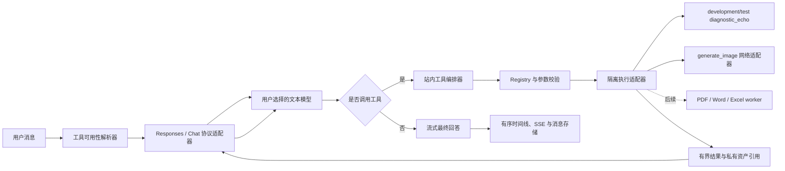

# AI 问答内部工具运行时与生图设计

> 日期：2026-07-20
> 状态：交互设计已确认，等待用户完成书面规格复核后进入实施计划
> 关联：`docs/functions/AI问答设计.md`、`docs/architecture/架构总览.md`、PLAN-20260722T022751000Z
> 替代范围：本文替代 2026-07-18 生图设计中“直接选择 `gpt-image-2`”和“普通 Responses 模型调用上游托管 `image_generation`”作为最终产品方案的部分；有序消息时间线、私有资产、前端渲染和历史验证记录继续有效。

## 1. 背景与根因

当前 AI 问答已经能够把 Responses 返回的联网、函数和托管生图事件投影为有序过程块，也有一条单独的 Images API 生图路径，但还不具备真正的站内工具循环：

1. `chat-tools.ts` 只描述上游托管工具，不能注册本站执行器。
2. Responses 的 `function_call` 只进入过程时间线，没有参数校验、本地执行、结果回灌和续答。
3. Chat Completions 流只收集正文，没有收集并重组分块 `tool_calls`。
4. 直接选择 `gpt-image-2` 会绕过文本模型和通用工具循环；普通模型托管生图又依赖上游原生 `image_generation`，当前真实账户两条路径均失败。
5. 图片资产只有一个物理对象，页面预览、点击原图和下载共用同一大图 URL；多兆字节图片会放大首页、会话切换和移动网络成本。
6. 输入图片目前由前端压成 JPEG，后端再压成 JPEG；格式、参数和编码责任重复，存在二次有损压缩和透明背景被铺白的问题。

Codex 的 `imagegen` 与 `gpt-image-2-cli` 共同证明了正确边界：文本模型或 Agent 选择一个独立图像工具，工具再使用专用凭据和 Images API 调用图像模型，返回的 Base64 只在执行侧解码为文件。产品实现不能把 Codex 本机 Skill、`auth.json`、`config.toml` 或私有密钥文件当成运行时依赖，而应沿用会话绑定的 API Key 和现有网关。

## 2. 目标

- 建立协议无关、可注册、可限制、可取消、可测试的 AI 问答内部工具运行时。
- 先用无副作用开发 Demo 验证完整工具循环，再把图片生成作为第一个生产工具接入。
- 让文本模型根据用户对话自动选择合适工具，服务端负责权限、资源、成本和协议边界。
- 后续 PDF、Word、Excel 工具只新增定义、执行器和结果投影，不修改聊天主流程。
- 保留现有有序助手时间线、站内 SSE、私有资产、刷新恢复、下载和再次引用能力。
- 统一聊天优化图片为 WebP，并把页面预览与原图下载拆成两个不可变对象。

## 3. 非目标

- 本阶段不接入 MCP、Skill 热加载、第三方目录扫描或远程工具注册。
- 不在主 Web 进程执行任意代码、Office 宏、Shell 或不可信文档脚本。
- 不实现 PDF、Word、Excel 的具体业务工具；只固定它们必须遵循的运行时边界。
- 不建立独立工具微服务、分布式队列或多实例协调；执行器接口必须允许后续迁移到 worker、子进程或外部沙箱。
- 不把图片 Base64、文档二进制、临时路径或凭据写入站内 SSE、消息正文或模型工具结果。
- 不提交、不推送、不部署；真实凭据只用于本地开发进程和本地测试数据。

## 4. 总体架构



### 4.1 模块职责

- `tools/contracts`：工具定义、执行上下文、结果、错误和资源限制契约。
- `tools/registry`：启动时显式注册工具，拒绝重复名称、无效 Schema 和不允许的执行模式。
- `tools/resolver`：按环境、模型能力、用户、系统账户、API Key、路由和依赖资源解析本轮可见工具。
- `tools/protocol`：把同一工具定义编译为 Responses 或 Chat Completions function tool，并把两种协议的调用和结果归一化。
- `tools/orchestrator`：驱动模型调用、工具执行、结果回灌、续答、限制、去重、取消和终态。
- `tools/executors/*`：一个工具一个模块，不反向控制聊天路由、消息存储或其他执行器。
- `tools/artifact-sink`：接收受控临时结果，校验后提交私有资产，返回稳定资产引用。

### 4.2 上游工具与站内工具

- `web_search` 等上游托管工具继续由上游执行；本站只解析和展示真实事件。
- `diagnostic_echo`、`generate_image` 和未来文档工具由本站执行，必须经过 Registry 和 Orchestrator。
- 两类工具共用同一助手时间线和前端过程组件，但必须保留 `executionOwner=upstream|application`，禁止本站重复执行上游工具。

## 5. 工具定义与可用性

每个工具定义至少包含：

```ts
interface ChatInternalToolDefinition {
  id: string
  version: string
  modelName: string
  title: string
  description: string
  inputSchema: JsonSchema
  executionKind: 'inline' | 'network_adapter' | 'worker'
  limits: ToolLimits
  availability: ToolAvailabilityPolicy
  duplicatePolicy: 'reuse_exact' | 'allow_repeat'
  execute: ChatInternalToolExecutor
  projectResult: ChatToolResultProjector
}
```

- JSON Schema 是模型声明和服务端参数校验的唯一事实来源，使用成熟 Schema 校验器验证，不能维护两套字段规则。
- 模型根据用户意图和工具描述决定参数；执行器只读取显式工具参数与最小授权上下文，不得重新扫描用户提示词或聊天历史来推断、覆盖、放宽参数，也不得执行未写入契约的提示词优化。通用规则见 [AI 工具创建规范](../../architecture/backend/AI工具创建规范.md)。
- `modelName` 使用稳定 ASCII 名称；用户可见中文名称由 `title` 提供，不能用显示文案作为协议标识。
- 工具只在当前文本模型声明 `function_calling` 且实际协议适配器支持函数调用时可见。
- 工具依赖的权限和路由必须在注入模型之前确认；不可用工具不进入本轮工具清单。
- 模型调用本轮未声明或未注册的名称时返回稳定 `tool_not_available` 并终止工具循环，不能动态查找或执行同名代码。

## 6. 工具循环与协议适配

1. 服务端完成会话、API Key、模型、上下文和工具可用性准备。
2. 协议适配器把站内工具和允许的上游托管工具编译到模型请求，首版固定 `parallel_tool_calls=false`。
3. 模型可以直接回答，也可以输出零个、一个或多个 function call。
4. 适配器把调用统一为 `{callId, toolName, arguments, sourceOrder}`；分块参数必须按 call ID 和索引有界重组。
5. Orchestrator 按 `sourceOrder` 串行校验和执行，过程事件原位更新对应 `tool_call` 块。
6. Responses 将必要的本轮 output items 与 `{type:'function_call_output', call_id, output}` 一起回灌；推理模型的 reasoning item 不能在工具往返中丢失。
7. Chat Completions 将 assistant `tool_calls` 和对应 `role='tool'` 消息回灌。
8. 模型继续回答或再次调用工具，直到生成最终正文或触发限制。

首版限制：

- 每轮最多 4 次模型请求、8 个站内工具调用、2 个图片生成调用。
- 工具串行执行；模型一次返回多个调用时也保持原始顺序。
- 相同工具版本与规范化参数在同一轮默认复用第一次结果，避免重复付费；明确声明 `allow_repeat` 的工具除外。
- 参数、单个模型可见结果、全部工具元数据和事件数分别有独立字节上限。
- 用户停止、会话清空或请求取消时，同一个 `AbortSignal` 贯穿模型请求、工具执行、网关请求、临时文件和资产提交。

## 7. 开发 Demo

`diagnostic_echo` 用于先证明通用运行时成立：

- 仅在 `development` / `test` 且显式开发开关开启时注册；生产环境忽略该开关并拒绝注册。
- 只接收一个有界字符串，返回确定性的结构化回显。
- 不访问网络、文件、数据库、环境变量或外部服务。
- 真实浏览器提示必须要求模型调用 Demo，页面依次出现工具过程和工具之后的最终回答。
- Demo 测试覆盖 Responses 与 Chat Completions 两种协议、参数分块、结果回灌、超时、取消、重复调用和循环上限。

## 8. 图片生成工具

### 8.1 调用边界

- `gpt-image-2` 不再作为 AI 问答中的文本模型直接选择；用户选择具备 function calling 的文本模型，由文本模型调用 `generate_image`。
- `generate_image` 使用会话绑定的真实 API Key，经现有本机网关调用 `/v1/images/generations`，继续复用认证、权限、路由、分组、账户、代理、额度、计费、使用记录和审计。
- 产品运行时代码不得读取 Codex Desktop 的 `auth.json`、`config.toml`、Skill 脚本或本机凭据文件。
- 当前图像模型由执行器配置固定为 `gpt-image-2`；模型参数不能携带 Base URL、API Key、任意模型名或输出路径。

### 8.2 工具参数与默认偏好

首版参数包含 `prompt`、可选 `size`、可选 `quality` 和可选 `output_format`；`n` 固定为 1。

- 用户明确指定 PNG、JPEG/JPG 或 WebP 时严格遵循；未指定时，服务端默认 `output_format=webp`。
- 原图不做本地二次有损压缩；WebP/JPEG 的 Images API `output_compression` 首版不暴露给模型，避免模型任意牺牲原图质量。
- 用户未明确指定宽高或分辨率时，模型可以根据工具描述选择 `auto` 或合适的明确尺寸；执行器不根据用户原话二次判断尺寸档位。
- “高清、精致、细节丰富”等质量描述只影响 `quality`，不能解释为大尺寸要求。
- 用户明确指定尺寸、分辨率或比例时优先遵循；服务端验证宽高为 16px 倍数、最长边不超过 3840px、宽高比不超过 3:1、总像素在 655,360 到 8,294,400 之间。
- 合法的明确尺寸原样传给图像上游，不区分“普通”和“大图”内部档位，不按提示词关键词放行或缩小。
- 模型未提供尺寸时使用上游支持的 `auto`；格式错误或违反协议边界时在外部调用前失败并把有界错误返回模型，不能静默改成其他尺寸。

系统提示词采用原则性偏好：

```text
调用图片生成工具时，如果用户没有明确指定宽高或分辨率，应根据图片用途、内容和构图需要自行选择合适的常规尺寸与宽高比例，不得自行选择 2K、4K 或其他超大尺寸。

用户明确指定宽高、分辨率或画面比例时，应优先遵循用户要求。“高清、精致、细节丰富”等质量描述不等于要求更大的图片尺寸。
```

### 8.3 原图、预览图与资产提交

一个逻辑 `assetId` 对应两个不可变对象：

- `original`：Images API 返回的原始生成图，用于点击查看、下载和需要完整质量的后续工具。
- `preview`：服务端生成的 WebP 缩略图，用于消息列表和会话恢复后的首屏展示。

预览策略：

- 最长边约 640px，不放大，WebP quality 78，目标上限 512 KiB。
- 首次编码超过上限时按统一策略降低质量或尺寸；不能回退为在页面中直接加载多兆字节原图。
- 预览变体必须使用 WebP；WebP 编码器异常时当前工具明确失败并保留错误原因，不隐式回退 JPEG，避免形成第三套优化格式。

提交顺序：

1. 上游 Base64 继续分块解码到受控临时文件，并校验 MIME、尺寸、字节数和 SHA-256。
2. 使用现有 Sharp 处理池从原图生成预览对象。
3. 原图和预览图均以确定性 storage key 原子写入对象目录。
4. 数据库事务一次提交两套 key、MIME、宽高、字节和 SHA-256，并创建 `assistant_output` 引用。
5. 容量账本按原图与预览图字节总和计费；任一对象或事务失败只清理尚未提交对象。
6. 资产过期或删除时同时删除两个对象；工具成功而模型续答失败时保留已经提交的两份图片和完成工具事实。

现有 `storage_key` 继续表示可供完整查看和模型输入选择的规范对象；为生成图增加独立预览对象字段。当前只需要两个变体，不为此重构成通用变体表。

### 8.4 浏览器读取与缓存

前端消息仍只保存 `assetId`，使用两个明确变体 URL：

```text
GET /my-chat/conversations/{conversationId}/assets/{assetId}/content?variant=preview
GET /my-chat/conversations/{conversationId}/assets/{assetId}/content?variant=original
```

- 消息 `` 使用 `preview`；点击图片和下载使用 `original`。
- 后端先校验登录用户、会话归属、资产归属、状态和有效期，再流式返回对应对象。
- 两个 URL 是不同浏览器缓存键，响应使用 `Cache-Control: private, max-age=86400, immutable`、变体 SHA-256 `ETag`、正确 `Content-Type` 和 `nosniff`。
- 缓存过期后的 `If-None-Match` 命中返回 304；同一天刷新和切换会话不重复下载正文。
- `private` 只允许当前浏览器缓存，禁止共享代理缓存私有图片；浏览器按本地容量主动淘汰缓存属于正常行为。
- 生成图再次加入输入框时只传 `{type:'input_image', assetId}`，不能重新上传或把原图转成 Data URL 放入站内请求。

## 9. 统一 WebP 优化图策略

聊天优化图片使用一套由后端拥有的策略和两个用途档位：

| 用途 | 输出格式 | 最大边 | 质量 | 字节上限 |
| --- | --- | ---: | ---: | ---: |
| 用户粘贴/上传后的模型输入图 | WebP | 1024px | 82 | 1 MiB |
| 页面预览缩略图 | WebP | 640px | 78 | 512 KiB |

- 生图原图和用户明确要求下载的格式不属于优化图，不强制本地转码。
- 后端通过聊天初始化契约返回上传策略；前端不再独立硬编码 JPEG 参数。
- 前端在上传前按模型输入档位压成 WebP，减少移动网络流量；浏览器本地预览可以继续使用 Blob URL。
- 后端仍完整解码并验证实际格式、像素、方向和字节数。符合标准的 WebP 验证后直接保存，避免再次有损编码；不符合标准的输入由同一后端处理器转码或拒绝。
- 透明通道由 WebP 保留，不再统一铺白底；GIF 作为 AI 输入仍按静态首帧处理。
- 前端编码器与 Sharp 不要求产出逐字节相同文件，统一的是格式、尺寸、质量档位和硬上限；后端结果是权威事实。

## 10. 隔离、权限与错误

执行器只获得最小上下文：轮次身份、`AbortSignal`、trace ID、进度发布器、已绑定权限的能力接口和资产 sink。执行器不得获得 Express 请求、完整数据库连接、全局配置、其他账户凭据或任意宿主路径。

- `inline` 仅允许确定性、无副作用的小工具。
- `network_adapter` 必须声明允许的目标；图片工具只访问现有本机网关。
- PDF、Word、Excel 默认使用独立 worker/子进程、每调用临时目录、最小环境变量、默认禁网、输出/产物/超时上限；后续可替换为容器而不改变 Orchestrator。

错误分类：

- 参数非法：不执行，返回有界错误给模型，最多允许一次修正调用。
- 未注册或无权限：`tool_not_available`，立即终止工具循环。
- 超时或上游能力失败：工具块失败，稳定错误码回灌模型，允许模型输出最终说明，但禁止自动重复付费调用。
- 协议损坏、状态不一致、资产提交失败：助手消息失败收口，保留已提交资产，只清理未提交临时对象。
- 取消：活动调用标记 canceled，终止网络 reader 或专属 worker，不能广泛终止无关进程。

## 11. 消息与前端投影

- 工具生命周期继续使用现有 `tool_call` 内容块；`item` 只保存有界安全摘要，如工具名、版本、阶段、耗时、错误码和资产 ID。
- 图片完成后追加现有 `output_image` 块；补充预览与原图尺寸/字节元数据时仍以 `assetId` 为读取授权主键。
- 过程状态映射为 requested、validating、running、committing_artifact、completed/failed/canceled，前端协议仍使用 started、updated、completed、failed、canceled。
- 活动过程渐进展开，终态自动折叠；工具后的最终文本必须保持在时间线后方，不能重新排到工具上方。
- 未完成消息继续隐藏时间和复制操作；失败工具和已提交图片都必须在终态消息中保持可见事实。

## 12. 迁移策略

- 保留 `generateChatImage()` 的 Images API、流式 Base64 解码和临时文件能力，将调用位置从 `chat.routes.ts` 特殊分支移入 `generate_image` 执行器。
- AI 问答模型目录过滤只能输出图片、不能承担文本续答的模型；图像工具另行确认 `gpt-image-2` 在当前 API Key 路由中可达。
- `chatHostedTools` 收敛为上游拥有的工具；站内 function tools 使用独立 Registry。
- 停止为普通文本模型注入上游托管 `image_generation`，不再依赖 `shouldOfferChatImageGenerationTool()` 的生图意图正则。
- Responses 解析器增加完整 function call 和必要 output item 收集；Chat SSE 解析器增加分块 tool call 收集。
- 保留上游图像事件解析作为协议兼容能力，但本站没有声明托管生图时不会主动触发。
- 不做旧工具结构、旧图片单对象或旧输入 JPEG 策略的运行时双读双写；按当前 schema、类型、Mock 和本地数据直接调整。

## 13. 测试与真实验收

### 13.1 自动测试

- Registry：重复名称、非法 Schema、生产环境 Demo、防止动态目录执行。
- Resolver：模型无 function calling、权限禁用、图像路由不可达、开发开关、上游/站内 owner 分离。
- Responses：分块参数、多调用、reasoning item、function_call_output、续答和流终态。
- Chat Completions：分块 tool_calls、assistant/tool 消息回灌、续答和 usage。
- Orchestrator：顺序、精确去重、参数错误、未知工具、超时、取消、模型轮次/调用上限、工具后正文位置。
- Demo：两种协议真实 Mock 工具循环且无外部副作用。
- 图片：WebP 默认、用户格式优先、常规尺寸选择、无依据大图缩小、显式大尺寸校验、reader cancel。
- 资产：原图/预览双对象、Sharp 预览、512 KiB 上限、原子提交、双对象清理、容量总和、续答失败保留。
- 缓存：preview/original URL 区分、私有缓存头、ETag 304、越权和过期 404。
- 上传：前端 WebP、后端统一策略、透明通道、静态 GIF、合规 WebP 不二次编码、非法 MIME/像素/字节拒绝。
- 前端：缩略图首屏、点击原图、下载原图、刷新缓存 URL 稳定、再次引用只传 assetId。
- 回归：联网搜索、即时双消息、有序过程、探活重附着、停止、重发、上下文压缩和按需加载。

### 13.2 真实顺序

1. Mock 全部通过后，启动本地环境并打开真实 AI 问答。
2. 创建“内部工具-Demo验收”，让真实文本模型自动调用 `diagnostic_echo`，验证过程与最终回答顺序。
3. 单独验证当前图像供应商的 `/v1/images/generations` 能力，再验证相同账户经本项目网关可达。
4. 创建“内部工具-图片生成验收”，验证 WebP 默认、场景比例、普通尺寸、显式尺寸和失败说明。
5. 验证页面只加载 preview，点击/下载加载 original，刷新命中缓存，生成图可再次加入输入框。
6. 使用手机视口验证上传 WebP、缩略图流量、长消息和输入区布局。
7. 运行聊天专项、前后端类型检查/构建、Go 回归、凭据扫描和差异检查。

## 14. 文档与后续扩展

- PLAN-20260722T022751000Z 继续追踪本需求，不新建近似重复计划。
- `docs/functions/AI问答设计.md` 和 `docs/architecture/架构总览.md` 在实现前标记“已确认、待实施”，完成后再切换为当前事实。
- PDF、Word、Excel 后续每个工具单独设计输入资产、worker、产物类型和前端投影；Registry、Orchestrator、协议适配和资产 sink 不重复实现。
- MCP、Skill、任意代码执行和第三方插件仍是独立范围，不因本地 function tool 运行时自动获得授权。

## 15. 书面验收标准

- 本文不再把直接选择图片模型或上游托管生图作为目标主流程。
- 工具选择、执行、回灌、续答、顺序、限制和取消均有唯一责任层。
- WebP 默认、用户格式优先、常规尺寸偏好和大图限制没有相互矛盾。
- 一个 `assetId` 同时支撑私有预览、原图查看、下载、刷新和再次引用。
- 优化图只有一套 WebP 策略，前后端不会继续维护相互独立的 JPEG 参数。
- 当前阶段没有暗含 MCP、第三方代码热加载、生产发布或历史兼容分支。
