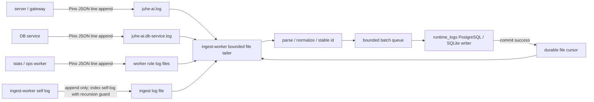

# 运行日志热路径无损解耦设计

## 1. 背景与结论

生产环境出现大量 `runtime log Redis XADD timed out after 1500ms`，同时 Node 进程事件循环延迟达到 `0.89s ~ 3.54s`。只读诊断确认 Redis `XADD` 平均约 `5.5µs`，实际 `EVAL(GET + XADD)` 平均约 `35µs ~ 64µs`，Redis 没有连接拒绝、客户端阻塞、AOF fsync 积压或对应慢日志。

当前超时不是 Redis 服务端执行 `XADD` 达到 1500ms，而是业务进程同步加工每条日志，并用同一事件循环处理 Redis Promise、socket 回包和 1500ms timer。事件循环停顿后，客户端墙钟 deadline 先触发，随后代码立即销毁 Redis client，形成 `timeout -> destroy -> reconnect -> disconnected/connect timeout` 放大链。

本设计不通过降采样、裁剪日志、缩短保留期或提高 Redis/PostgreSQL 并发掩盖问题。目标是把日志完整消化能力移出业务热路径。

## 2. 目标

- Web/网关主进程、DB service、stats-worker 和 ops-worker 的日志热路径只保留 Pino 序列化和顺序文件追加。
- 业务进程不再为运行日志索引执行逐行 Buffer 扫描、UTF-8 转换、`JSON.parse`、字段提取、字符串清洗、SHA256、`JSON.stringify`、Redis `EVAL/XADD` 或 Redis 连接管理。
- ingest-worker 以日志文件为耐久 spool，按文件标识与 byte offset 增量读取完整 JSON Lines，解析后批量写入运行日志索引存储。
- 消费速度短时落后时保留积压并持续追赶，不把压力转换成主线程排队、Redis 重连风暴或日志丢弃。
- 文件游标只在对应索引批次成功提交后推进；进程或 worker 重启后从最近成功位置继续。
- 轮转文件在确认完全消费前不得被日志清理任务删除。
- 修复运行日志客户端墙钟超时的错误归因和单次 timeout 销毁连接行为；运行日志文件消费方案落地后，业务进程不再需要运行日志 Redis producer。
- 把性能约束写入权威开发文档和回归门禁，避免后续重新把日志加工、脱敏或 Redis 投递加入业务热路径。

## 3. 非目标

- 不部署、不发布生产版本，不修改生产配置或生产数据。
- 不调整 PostgreSQL `max_connections`、PgBouncer 池或 Redis 最大客户端数。
- 不改变鉴权、权限、外部输入校验、HTTP 安全头、对外响应保护等非日志安全边界。
- 不新增 Kafka、外部消息系统或多实例分布式日志采集架构。
- 不保留旧运行日志 Redis Stream 的兼容双写、双读或自动迁移分支。
- 不扩大普通运行日志的业务捕获范围。

## 4. 方案比较

### 4.1 方案 A：业务进程把原始日志直接写 Redis Stream

优点是可以去掉主线程的解析和 SHA256。缺点是业务事件循环仍负责 Redis socket、Promise settlement、连接状态和超时，无法消除本次客户端假超时根因；Redis 暂时不可用时还必须处理主线程背压和无损暂存。

不采用。

### 4.2 方案 B：业务进程通过 IPC 把原始日志交给 ingest-worker

优点是常态延迟低，解析和 Redis 投递可以移到 ingest-worker。缺点是 IPC 和进程内待发送队列不是耐久事实源；server 或 supervisor 崩溃时，尚未送达的消息可能丢失。为了真正无损还要额外实现本地磁盘 spool，形成重复体系。

不采用为主路径。

### 4.3 方案 C：日志文件作为耐久 spool，ingest-worker 按游标追尾

日志本来就需要完整写文件，直接把现有文件作为唯一原始来源，不增加业务进程网络 I/O。ingest-worker 通过 bounded stream、完整行边界和持久游标消费；消费慢时文件自然承载积压，重启后可以继续。

采用该方案。

## 5. 目标架构

## 6. 业务热路径

### 6.1 文件写入

- `RotatingFileLogStream` 只负责目录创建、顺序追加、大小统计、轮转和清理调度。
- 删除 `emitIndexedLines()`、pending line Buffer、逐字节换行扫描、同步 UTF-8 转换以及 `emitRuntimeLogLine()` 调用。
- Pino 仍生成一条完整 JSON Line；文件流回调只反映文件写入是否完成。
- 日志输出层不增加脱敏、正则扫描、字段名匹配或 URL 清洗。

### 6.2 进程启动

- server、DB service、stats-worker 和 ops-worker 不再注册运行日志索引 sink。
- ingest-worker 启动文件追尾服务；它是运行日志解析、索引和游标写入的唯一 owner。
- performance 模式要求运行日志文件开启；如果关闭文件输出却要求运行日志索引，启动时 fail-fast，不能退回业务进程同步索引。
- standalone 模式也复用文件追尾架构，不保留另一套主线程同步索引分支。

## 7. 文件命名、轮转与发现

- 每个常驻进程角色使用独立文件，至少包含 server、DB service、ingest-worker、stats-worker、ops-worker，避免多个 worker 进程并发追加同一个文件。
- 轮转文件名保留来源 basename，例如 `juhe-ai.stats-worker.<timestamp>.<uuid>.log`，不能统一写成 `juhe-ai.<timestamp>...`。
- ingest-worker 使用 `opendir()` 流式扫描日志目录，只匹配受控文件名规则；不一次性读取整个目录。
- 消费顺序优先未完成的轮转文件，再处理当前活动文件；同一文件严格按 offset 单向推进，不跨文件共享 offset。
- 目录扫描和单轮处理都有文件数、字节数和行数窗口；达到窗口后主动 yield，下一轮继续，不形成长事件循环占用。

## 8. 游标与无损语义

- 游标键至少包含规范化路径、文件标识、offset、line number、已观察文件大小、mtime、最近成功时间和最近错误。
- 文件标识使用可验证的 `dev + ino + birthtime` 或等价稳定信息；轮转后的旧文件保持独立游标。
- 只在索引 batch 成功提交后推进 offset。解析失败的完整行记录明确错误并推进，避免单行永久堵塞；存储失败不推进。
- 文件尾部没有完整换行时不推进，等待下一轮补齐。
- 超长单行使用 bounded scan 寻找完整换行；索引内容按现有明确上限带截断标记，但原始文件保持完整。
- 新发现的当前活动文件首次启动时从当前文件尾开始，避免把安装前历史日志突然全量导入；新发现的轮转文件从头读取。已经存在游标的文件始终从游标继续。
- 运行日志索引是可重建派生数据；原始文件在保留期内是重建来源。

## 9. 清理保护

- 清理任务删除轮转文件前查询文件消费状态。
- 未存在完成游标、游标 offset 小于文件大小、或最近消费失败的文件均为 protected，不能因保留天数或最大文件数删除。
- backlog 恢复后，完全消费的轮转文件重新进入正常保留期和最大文件数清理。
- 清理扫描同样有界并定期 yield，不能为了保护积压阻塞日志写入。

## 10. ingest-worker 自身日志与递归保护

- ingest-worker 使用独立日志文件，避免与 stats-worker、ops-worker 多进程并发写同一文件。
- 文件追尾和索引失败信息直接写 `stderr` 的最小诊断通道，不再通过普通 Pino logger 回到被消费文件，避免错误日志递归制造新索引任务。
- ingest-worker 自身普通业务日志可以被索引；当前消费轮次只读取轮次开始前的文件大小快照，不追逐本轮新产生的日志。

## 11. Redis producer 处理

- 运行日志不再通过 Redis Stream 入队，因此删除运行日志专用 `BoundedRuntimeLogRedisProducer`、1500ms command deadline、专用 Redis client、运行日志 Stream consumer 和相关重连销毁逻辑。
- 使用记录、审计、操作日志、公开接口日志等其他 Redis Stream 事实队列不在本次范围，保持现有边界。
- 删除运行日志 Stream contract 时同步更新队列注册表、运行态 DTO、监控展示和回归测试，不保留返回恒定零值的兼容字段。

## 12. 运行态与可观测性

运行日志运行态改为文件消费指标：

- `discoveredFileCount`
- `pendingFileCount`
- `pendingBytes`
- `oldestPendingMtime`
- `currentFile`
- `currentOffset`
- `lastReadAt`
- `lastCommitAt`
- `lastError`
- `protectedRotatedFileCount`

不再暴露运行日志 Redis producer 的 in-flight、timeout、disconnected 和 command failure 计数。

## 13. 性能规范

权威文档必须加入以下门禁：

- server、DB service、路由、中间件和非 ingest worker 的普通日志热路径禁止 `JSON.parse`、正则扫描、递归遍历、脱敏、哈希、索引 DTO 组装、数据库写入和 Redis 命令。
- 日志派生加工只能由 ingest-worker 从耐久 spool 按 offset/cursor 有界执行。
- 不允许以“安全优化”“统一清洗”“便于搜索”为理由把上述加工重新加回热路径；确有新需求必须先提供生产 profile、吞吐预算和独立 worker 设计。
- 不允许用丢弃、采样、缩短保留期或调大连接并发代替消费能力建设。
- 新增运行日志路径必须有静态门禁和压力回归证明业务进程不会注册索引 sink 或创建运行日志 Redis producer。

## 14. 测试与验收

### 14.1 静态与单元回归

- logger 文件流源码不包含运行日志 sink、逐行扫描、JSON 解析、正则或 SHA256。
- server、DB service、stats-worker 和 ops-worker 不注册运行日志索引 sink。
- ingest-worker 是文件追尾与索引写入唯一 owner。
- 轮转命名按角色隔离。
- 未消费轮转文件受到清理保护。
- cursor 只在 batch commit 成功后推进。
- 不完整行、超长行、轮转、截断、重启续读、存储失败重试均有回归。

### 14.2 本地验证

- backend typecheck、相关 runtime log 回归和 performance boundary 回归通过。
- 生成多角色日志并持续写入，验证业务进程事件循环不执行索引加工。
- 人为暂停 ingest-worker 后继续产生日志，恢复后 backlog 能完整追平，无 drop。
- 在消费期间触发轮转，验证旧文件完全消费后才允许清理。

### 14.3 真实 PostgreSQL / Redis 验证

- 使用 `192.168.1.203` 测试环境创建当前测试 schema；测试表或测试数据库可以按任务隔离后清理重建。
- 验证运行日志索引直接批量写 PostgreSQL，Redis queue 不再出现运行日志 Stream 新写入。
- Redis 其他事实 Stream 的使用记录、审计、操作日志等行为不受影响。
- 压力期间记录 server、DB service、ingest-worker event-loop lag、日志产生速率、消费速率和 backlog 收敛时间。

### 14.4 完成标准

- 业务进程日志热路径不存在运行日志索引加工或 Redis 投递。
- ingest-worker 停止期间日志文件继续完整增长，恢复后索引条数和完整行数最终一致。
- 无运行日志 Redis 1500ms timeout 和单次 timeout 销毁连接链路。
- 所有相关回归、typecheck、构建和真实 PostgreSQL/Redis smoke 通过。
- 两名只读复核 Agent 完成独立复核与交叉质疑，高严重度问题全部闭合。

## 15. 合并与发布边界

- 开发分支从最新 `master` 创建；开发期间在逻辑阶段完成后同步 `origin/master`，冲突在独立 worktree 内解决并重跑受影响验证。
- 完成后合并并推送 `master`，再把最新 `master` 反向合并到 `feature/20260706-go` 并推送该远端分支。
- 本任务不执行构建发布包、部署、生产配置修改或上线；上线等待用户另行通知。
