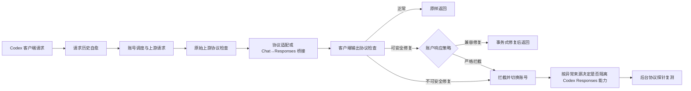

# Codex Responses 协议防火墙与会话修复设计

## 1. 背景

Codex 桌面客户端与 OpenAI Responses-compatible 上游之间已经观察到多类会话污染和协议不兼容问题：

- `custom_tool_call` 携带 `fc_*`，上游要求 `ctc_*`。
- `store=false` 时，历史仍携带 `rs_*` 等上游 item ID，后续请求被上游以“item 未持久化”为由拒绝。
- Chat Completions 转 Responses 的桥接器先生成 function-call ID，之后才确定 item 是 custom tool，导致类型与 ID 前缀不一致。
- 部分中转上游可能把请求映射到其他模型或其他协议实现，返回的包装层、工具事件和 usage 形态不再满足 Codex 客户端契约。
- 单纯依靠客户端本地删除 ID 可以止血，但无法阻止后续坏响应继续污染其他 Codex 会话。

这些问题不能继续采用“遇到一个错误码增加一个 if”的方式修复。设计目标是建立统一、版本化、可审计的 Codex Responses 协议防火墙，并在 AI 账户层提供兼容修复和严格拦截策略。

## 2. 目标与非目标

### 2.1 目标

1. 在请求进入上游前修复可安全恢复的旧会话历史，避免坏 item ID 在账号切换后继续传播。
2. 在响应写入 Codex 客户端前验证 Responses item、工具调用、流式生命周期和 compaction 契约。
3. 只执行可证明没有语义变化的自动修复；无法证明安全时必须拦截或告警。
4. 严格区分客户端历史污染、原始上游异常和网关桥接异常，避免错误处罚正常账号。
5. 严格拦截时只隔离当前账号的 Codex Responses 能力，不影响 Chat Completions 等其他能力。
6. 使用记录区分正常成功、修复后成功、切号后成功和协议失败，不把修复后的请求伪装成完全正常。
7. 模型身份可信度与协议一致性分开诊断，不因为协议异常直接宣称“上游不是 GPT”。

### 2.2 非目标

- 不通过黑盒探针证明上游物理模型身份。
- 不自动修改消息正文、reasoning、工具参数、工具结果、usage 或 finish reason。
- 不为未知 Responses item 类型猜测已知类型。
- 不在语义已经提交给客户端后拼接第二个上游响应。
- 第一版不实现上游 Responses WebSocket 的跨连接状态修复。
- 不因一次普通请求异常直接把整个 AI 账户写成全局 `temporary_unavailable` 或 `error`。

## 3. Codex 源码契约依据

本设计以本地 Codex 源码 `F:\temp-project\agent\openai-codex-main` 的提交 `1bbdb32789e1f79932df44941236ea3658f6e965` 为核对基线。

提交 `c9d52de5c`（2026-07-11，`Require prefixes for outbound response item IDs`）引入了 Responses item ID 前缀约束。源码中的稳定映射为：

| item 类型 | 前缀 |
| --- | --- |
| `additional_tools` | `at_*` |
| `message` | `msg_*` |
| `agent_message` | `amsg_*` |
| `reasoning` | `rs_*` |
| `local_shell_call` | `lsh_*` |
| `function_call` | `fc_*` |
| `tool_search_call` | `tsc_*` |
| `function_call_output` | `fco_*` |
| `custom_tool_call` | `ctc_*` |
| `custom_tool_call_output` | `ctco_*` |
| `tool_search_output` | `tso_*` |
| `web_search_call` | `ws_*` |
| `image_generation_call` | `ig_*` |
| `compaction` / `context_compaction` | `cmp_*` |

源码还确认以下边界：

- legacy rollout 反序列化保持宽松，新 ID 生成才强制前缀。
- 当前 Codex 出站过滤只判断 ID 是否包含非空前缀和后缀，不判断前缀是否与 item 类型一致。
- `store=false` 且 item IDs 功能关闭时，Codex 会删除请求中的 item ID，但保留完整 item 内容。
- 工具调用与工具结果通过 `call_id` 配对，不通过 item ID 配对。
- 缺失 item ID 时，Codex 可以根据 item 类型生成对应前缀的新 ID。
- Responses WebSocket 使用独立的 `previous_response_id` 做连接内增量上下文，不等价于普通 item ID。

因此，网关需要实现比 Codex 当前客户端更严格的“类型与前缀一致性”验证，同时不能把 `item.id`、`call_id` 和 `previous_response_id` 混为一个身份。

## 4. 总体架构



整体由六个相互隔离的组件构成：

1. `CodexRequestHistorySanitizer`：始终启用的请求历史自愈层。
2. `CodexResponsesContractRegistry`：版本化 item、事件和字段契约。
3. `CodexResponsesContractValidator`：只负责检查和生成诊断，不修改数据。
4. `CodexResponsesRepairPlanner`：根据诊断生成有界修复计划。
5. `CodexResponsesRepairExecutor`：在副本上执行计划并验证不变量。
6. `CodexProtocolHealthProbe`：固定账号执行后台协议探针，确认恢复或持续异常。

验证、计划和执行必须分离。验证器不能直接修改对象，执行器不能自行增加规则。

## 5. 身份模型

协议防火墙内部必须分离五种身份：

| 字段 | 语义 |
| --- | --- |
| `internalItemKey` | 网关内部追踪 item 的稳定键，不对外发送 |
| `upstreamItemId` | 上游返回的原始 item ID，只用于诊断和审计 |
| `clientItemId` | 返回给 Codex 客户端的规范 item ID |
| `callId` | 工具调用与输出配对 ID，原则上禁止修改 |
| `previousResponseId` | 上游 WebSocket 连接内增量状态，单独管理 |

流式 item 的内部键使用 `responseResourceId + outputIndex`。不能只使用原始 item ID，因为异常上游可能重复使用 ID，或在同一生命周期中改变 ID。

客户端 wire ID 与上游持久化 ID 不再视为同一命名空间。网关可以向客户端返回规范 `clientItemId`，但在账号切换或 `store=false` 时不得把该 ID当成新上游可解析的持久化引用。

## 6. 异常来源归因

协议检查设置两个强制检查点：

1. 检查点 A：检查原始上游协议。
2. 检查点 B：检查协议适配或桥接后的客户端输出协议。

稳定来源枚举：

```ts
type CodexProtocolIssueProvenance =
  | 'request_history'
  | 'raw_upstream'
  | 'gateway_bridge'
  | 'unknown'
```

归因规则：

- 请求到达网关时已经异常：`request_history`。
- 原生 Responses 上游在检查点 A 已异常：`raw_upstream`。
- 检查点 A 符合其声明协议，检查点 B 异常：`gateway_bridge`。
- 配置声明支持原生 Responses，但实际返回 Chat、HTML 或无法识别包装：`raw_upstream`。
- 账号显式配置 `responses -> chat_completions` 映射，Chat 原始响应正常但桥接输出异常：`gateway_bridge`。
- 缺少原始数据或解析被有界大小限制跳过：`unknown`。

只有 `raw_upstream` 可以触发账号 Codex Responses 能力隔离。`gateway_bridge` 必须记录为网关缺陷，不能处罚账号。

## 7. 修复安全分级

### 7.1 R0：无语义变化修复

R0 默认允许自动执行：

- `store=false` 且 item 包含可重放完整内容时，删除请求中的 item ID。
- 请求历史的已知 item 类型与 ID 前缀不匹配时，删除 item ID。
- 请求历史的 ID 为空或没有合法前缀时，删除 item ID。
- 响应尚未语义提交时，根据已经确定的 item 类型生成新的 `clientItemId`。
- 在同一响应生命周期内一致改写 `item_id` 等纯引用字段。
- 保留 item 数量、顺序、`output_index`、类型、正文、reasoning、usage、工具数据和 `call_id`。

请求历史不能把 `fc_bad` 简单改名为 `ctc_bad`。该 ID 可能属于另一个持久化命名空间；安全行为是删除 ID，让当前接收方按完整 item 内容重新处理。

响应生成阶段可以创建新的 `ctc_*`，因为该 ID 尚未暴露给客户端，也不假装引用一个已存在的上游对象。

### 7.2 R1：确定性专属桥接

R1 只允许在拥有完整请求工具声明的专属桥接器内执行：

- Chat tool call 必须先根据声明映射确认是 function 还是 custom。
- 确认类型后才生成 `fc_*` 或 `ctc_*`。
- `arguments -> input` 由对应 custom tool adapter 转换。
- `added/delta/done/completed` 必须共享同一规范 ID、类型、`call_id` 和 `output_index`。
- 无法从声明映射确定工具类型时，不得根据名称猜测 custom tool。

通用协议防火墙不能负责 function/custom 语义转换。它只允许验证转换结果，并在结果不满足契约时拦截。

### 7.3 R2：禁止自动修复

以下操作一律禁止静默执行：

- 修改 `call_id`。
- 根据工具名称、参数形状或模型文本猜测 item 类型。
- 修改工具名称、namespace、arguments、input 或 output。
- 修改消息正文、reasoning summary、reasoning content 或 `encrypted_content`。
- 修改 usage、finish reason、status code 或模型字段。
- 自动补造缺失的真实工具结果。
- 删除只有 ID、没有可重放内容的 reasoning 或其他持久化引用 item。
- 把未知新类型转换为当前已知类型。
- 在客户端已经看到 item ID 后改变其 ID 或类型。

R2 命中时返回不可安全修复结果，并根据账户策略拦截或告警。

## 8. 事务式修复

修复流程固定为：

```text
解析
→ 生成诊断
→ 生成修复计划
→ 在副本上应用计划
→ 验证不变量
→ 重新执行完整协议校验
→ 全部通过后提交
```

禁止边扫描边原地修改，更禁止流式事件已经写出后再回头修正前序事件。

每次修复必须验证：

- 除允许的 ID 路径外，修复前后规范化语义哈希一致。
- item 数量和顺序一致。
- `call_id` 图一致。
- 工具调用和工具结果配对关系一致。
- `output_index` 一致。
- 文本、工具数据、reasoning、usage 和完成状态一致。
- 修复后所有已知类型与 ID 前缀一致。
- 一个原始 ID 映射到多个不同 item 时失败，不尝试自动消歧。
- 修复计划中的每一个字段路径都属于当前 contract revision 的允许列表。

修复记录只保存规则 ID、允许路径、前后摘要哈希和有界诊断，不保存新的未脱敏正文副本。

## 9. 请求历史自愈

请求历史自愈属于网关安全基线，始终启用，不受账户“响应修复”或“严格拦截”开关影响。

### 9.1 可修复请求

| 情况 | 行为 |
| --- | --- |
| 完整 `custom_tool_call` 携带 `fc_*` | 删除 `id`，保留 `call_id` 和完整内容 |
| 完整 reasoning 携带未持久化 `rs_*` | 删除 `id`，保留 summary/content/encrypted_content |
| `store=false` 且请求带完整 item | 删除所有上游持久化 item ID |
| 从前一账号切换到新账号 | 删除账号作用域或上游桶作用域的历史 item ID |
| legacy 无前缀 ID | 删除 `id` |

### 9.2 不可修复请求

如果 item 只有持久化 ID，没有 summary、content、encrypted content、工具数据或其他可重放负载，删除 ID 后不能形成合法完整 item。此时返回：

```text
contractOutcome = unrecoverable_history
errorCode = codex_history_item_unrecoverable
```

不得静默删除整个 item，因为这可能造成真实上下文丢失。

### 9.3 持久化作用域

上游能力需要声明：

```ts
type ResponsesPersistenceScope =
  | 'none'
  | 'account'
  | 'upstream_bucket'
  | 'provider_global'
  | 'websocket_connection'
```

当前 OpenAI-compatible HTTP/SSE 账号默认使用 `none`。第一版不允许根据上游自报字段自动提升持久化作用域。

## 10. 响应协议防火墙

### 10.1 JSON 响应

- 在写出下游前解析有界 JSON。
- 检查 `response.output[]` 中所有已知 item。
- 检查同一 `call_id` 的调用与输出类型是否一致。
- 检查 compaction 数量和类型。
- 修复模式只执行 R0/R1。
- 严格模式对任何已确认的已知契约违反直接拦截。

### 10.2 SSE 响应

- `response.output_item.added` 已包含 item 类型时立即建立内部身份。
- 类型确认前不得向客户端发送猜测 ID。
- 同一 `responseResourceId + outputIndex` 的所有事件共享一个 `clientItemId`。
- 后续 delta/done 发现原始 ID 改变时判定 `event_item_id_inconsistent`。
- 真实协议事件写出前可以服务端换号；真实协议事件写出后只能终止当前流。
- SSE 注释心跳只提交 transport，不提交 semantic，仍允许隐藏切号。

### 10.3 未知类型

未知 item 类型本身不等于错误：

- 不修改未知 item。
- 记录 `unknown_item_type`。
- 兼容修复模式原样透传并显示协议告警。
- 严格模式只有在同时违反通用结构约束时才拦截，不能仅因版本更新出现新类型就阻断所有请求。

## 11. 账户配置

AI 账户高级配置中新增“Codex 响应保护”区域，仅在账户能够承接 Codex Responses 时展示。

### 11.1 用户开关

1. `兼容修复`：默认开启。
2. `严格拦截`：默认关闭。

凭据中的非敏感配置结构：

```ts
interface CodexProtocolGuardConfig {
  revision: 1
  responseRepairEnabled: boolean
  strictInterceptEnabled: boolean
}
```

保存于：

```text
credentials.codex_protocol_guard
```

后端派生模式：

| 修复 | 拦截 | 派生模式 |
| --- | --- | --- |
| 开 | 关 | `compatibility_repair` |
| 关 | 关 | `observe_only` |
| 任意 | 开 | `strict_intercept` |

严格拦截优先于响应修复。开启严格拦截时，前端禁用响应修复开关的交互，但保留原设置，关闭拦截后恢复。

关闭两个开关时显示明确风险提示：网关仍执行请求历史自愈，但不会修复或拦截上游响应，异常响应可能污染 Codex 客户端会话。

### 11.2 默认与兼容

- 新建和既有 Codex-capable 账户缺少配置时默认 `responseRepairEnabled=true`、`strictInterceptEnabled=false`。
- 不支持 Responses 的账户不展示开关，运行时忽略该配置。
- 配置只作用于 `clientProfile=codex + endpointFamily=responses`，不改变普通 OpenAI Responses 客户端默认透传边界。
- 系统提供一个紧急全局覆盖，可把所有账号降级到 `observe_only`，用于修复器出现未知问题时快速止损。

## 12. 严格拦截与账号处置

严格拦截命中后按以下顺序处理：

1. 确认 `semanticCommitted=false`。
2. 终止当前上游 attempt，不向客户端写出坏事件。
3. 记录失败 attempt 和协议诊断。
4. 排除当前账号并尝试下一账号。
5. 只有 provenance 为 `raw_upstream` 时，对当前账号建立 Codex Responses lane 的短 TTL 回避。
6. 投递固定账号的后台协议探针。
7. provenance 为 `gateway_bridge` 时记录网关故障，不建立账号回避。

能力级作用域建议使用：

```text
accountId + clientProfile(codex) + endpointFamily(responses)
```

该回避不修改账户主状态，不影响 Chat Completions、健康检查的其他 endpoint mode 或其他客户端画像。

如果已经 `semanticCommitted=true`：

- 不允许透明切号。
- 终止当前流。
- 记录 `late_violation`。
- 客户端结果按失败处理。
- provenance 仍用于决定是否建立能力级回避。

## 13. 能力健康状态与后台探针

能力诊断使用独立状态，不复用账户全局 `status`：

```ts
type CodexResponsesHealthStatus =
  | 'unknown'
  | 'healthy'
  | 'degraded'
  | 'probing'
```

诊断快照至少包含：

- `status`
- `reasonCode`
- `issueProvenance`
- `contractRevision`
- `firstSeenAt`
- `lastSeenAt`
- `avoidUntil`
- `consecutiveFailureCount`
- `consecutiveSuccessCount`
- `lastProbeTraceId`
- `lastProbeAt`

后台探针固定使用被诊断账号，不允许静默切号，至少覆盖：

1. Responses JSON 基础对象。
2. Responses SSE 生命周期。
3. function tool call。
4. custom tool call。
5. item ID 前缀和生命周期一致性。
6. `call_id` 配对。
7. usage 基础形态。

运行时首次确定性异常可以立即建立短 TTL lane 回避，但持久诊断进入 `degraded` 需要两次独立探针观察到相同硬契约异常。连续两次完整探针通过后恢复 `healthy` 并解除诊断回避。TTL 自然过期不等于诊断恢复，下一次调度仍需遵守现有半开或恢复探针机制。

## 14. 模型身份与协议检测

在线协议防火墙保护每个请求，但不判断物理模型身份。离线模型检测继续输出分离维度：

- `identityStatus`
- `mappingStatus`
- `usageIntegrityStatus`
- `protocolStatus`
- `evidenceStatus`

新增 Codex 协议 canary 时，结果进入 `protocolStatus`，不能直接改写 `identityStatus`。

当响应模型字段、行为指纹和可信对比同时异常时，可以输出“疑似降级或未声明映射”；仅出现 `fc/ctc`、SSE 生命周期或 compaction 包装异常时，只能表述为“协议实现或转换层不兼容”。

## 15. 统一诊断结果

```ts
type CodexContractOutcome =
  | 'clean'
  | 'repaired_safe'
  | 'repaired_bridge'
  | 'observed_unknown'
  | 'blocked_upstream_violation'
  | 'blocked_gateway_violation'
  | 'unrecoverable_history'
  | 'late_violation'
```

典型 issue code：

- `item_id_prefix_mismatch`
- `unpersisted_item_reference`
- `event_item_id_inconsistent`
- `duplicate_item_identity`
- `tool_call_type_mismatch`
- `orphan_tool_output`
- `compaction_output_count_mismatch`
- `unknown_item_type`

错误码、修复规则和中文说明由版本化 registry 统一维护，禁止散落在路由和 UI 中重复定义。

## 16. 使用记录与前端展示

### 16.1 数据模型

保留现有 `success` 作为客户端最终交付结果和账务统计事实。修复后客户端成功获得合法响应时，`success` 仍为 `true`，不能为了黄色标签改成失败。

使用记录新增：

```ts
interface UsageProtocolDiagnostics {
  contractOutcome: CodexContractOutcome
  contractRevision: string
  issueProvenance?: CodexProtocolIssueProvenance
  issueCodes?: string[]
  issueCount?: number
  repairRuleIds?: string[]
  initialAccountId?: string
  finalAccountId?: string
}
```

存储建议使用：

- 顶层窄字段 `protocol_outcome`，用于列表展示和筛选。
- 有界 `protocol_diagnostics_json`，保存详细诊断。
- issue code、repair rule 最多各保存固定数量，超出只记录 omitted count。

### 16.2 标签规则

| 最终结果 | 标签 | 颜色 |
| --- | --- | --- |
| `success=true`、`clean` | 成功 | 绿色 |
| `success=true`、`repaired_safe/repaired_bridge` | 成功 · 已修复 | 黄色 |
| 首账号被拦截、后续账号成功 | 成功 · 已切号 | 黄色 |
| `success=true`、`observed_unknown` | 成功 · 协议告警 | 黄色 |
| 严格拦截且账号耗尽 | 失败 · 协议异常 | 红色 |
| 语义提交后发现异常 | 失败 · 响应已污染 | 红色 |

黄色标签的悬浮说明展示：

- 问题类型。
- 异常来源。
- 是否发生修复或切号。
- 原账号和最终账号。
- contract revision。
- traceId。

列表不展示原始工具参数、正文或 reasoning。

### 16.3 账户页面

账户主状态仍显示真实全局状态。能力诊断额外显示：

- `Codex Responses 正常`
- `Codex Responses 检查中`
- `Codex Responses 协议异常`

协议异常标签只表示该能力 lane 的诊断，不得让用户误认为整个账号已经停用。

## 17. 审计与可观测性

每次诊断至少记录：

- 检查点 A/B。
- provenance。
- contract revision。
- issue code。
- item type。
- expected prefix / observed prefix。
- output index。
- downstream 是否 transport/semantic committed。
- repair rule IDs。
- 修复前后有界摘要哈希。
- 是否切号、是否建立 lane 回避。

禁止把完整 `encrypted_content`、完整工具参数或响应正文复制到新的诊断字段。原始审计是否捕获仍遵守现有审计开关、权限和保留期。

## 18. 版本化与向前兼容

第一版 contract revision 建议命名：

```text
codex-responses-2026-07-11-r1
```

registry 每个规则包含：

- item type。
- 允许前缀。
- 必需和可选字段。
- 允许出现的事件阶段。
- 可以引用该 item 的事件字段。
- repair safety level。
- 适用 contract revision。
- 对应 Codex 源码提交和测试 fixture 来源。

新增 Codex 类型时先更新 registry 和 fixture，再提升 revision。旧 revision 在支持窗口内保留。未知类型默认透传告警，不能因 registry 尚未更新就全局阻断。

## 19. 灰度与紧急回退

上线分四阶段：

1. `shadow`：只运行双检查点和诊断，不修改、不拦截、不处罚账号。
2. `safe_repair`：启用经过 fixture 验证的 R0 修复，账户 UI 仍不开放严格拦截。
3. `strict_opt_in`：开放账户严格拦截开关，默认关闭。
4. `probe_close_loop`：启用能力级回避、后台复测和账户诊断标签。

紧急回退要求：

- 管理员可以把全局模式立即降级到 `observe_only`。
- 回退不删除账户配置和诊断事实。
- 已建立的短 TTL 回避可以由管理员解除，但解除操作必须留审计。
- 修复器异常不能回退为静默丢弃响应，必须原样透传告警或显式失败。

## 20. 测试策略

### 20.1 Codex 源码 fixture

从当前 Codex 源码构造固定 fixture，覆盖所有已知 `ResponseItem` 类型、正确前缀、缺失 ID、legacy ID 和错误前缀。

fixture 需要记录来源 commit；Codex 源码更新后通过独立同步检查发现契约差异，不能运行时抓取外部源码。

### 20.2 单元测试

- registry 全类型映射。
- request sanitizer 删除 ID 后保留所有其他字段。
- `call_id` 图不变。
- R0 修复前后语义哈希一致。
- 重复 ID、跨类型冲突和未知类型。
- provenance A/B 判定。
- 严格拦截优先级。
- 两个账户开关的三种派生模式。

### 20.3 流式状态机测试

- added/delta/done/completed 正常生命周期。
- added 为 `fc_*`、类型为 custom。
- 生命周期中途改变 item ID。
- 同一 ID 出现在多个 output index。
- 拦截发生在 semantic commit 前后。
- SSE comment 心跳后仍可换号。
- 已输出真实文本后禁止拼接第二条流。

### 20.4 桥接测试

- function tool 从源头生成 `fc_*`。
- custom tool 从源头生成 `ctc_*`。
- 名称分片和参数先到、工具类型后确定的情况。
- configured Responses→Chat 映射。
- bridge 产生异常时 provenance 为 `gateway_bridge`，不处罚账号。

### 20.5 集成与回归

- 两个已观察错误的精确回归：`rs_* not persisted`、`fc_* expected ctc`。
- JSON/SSE、API Key/OAuth、原生 Responses/Chat bridge 组合。
- strict intercept 后切号成功与账号耗尽。
- 修复成功的 usage 仍计成功，但展示黄色。
- 账号只隔离 Codex Responses，Chat 请求继续调度。
- 后台探针固定账号，不允许自动切号掩盖异常。

### 20.6 属性测试

针对 R0 repair plan 生成随机 item 序列，验证：

- 允许字段之外没有变化。
- 修复器幂等。
- 相同输入产生相同诊断类别和规则集合。
- 修复后再次执行修复得到空计划。
- 任意失败不会返回部分修改结果。

## 21. 验收标准

1. 当前两个已知错误均有自动化回归，并能在默认兼容修复模式下避免污染客户端。
2. `call_id`、工具正文、reasoning 和 usage 不被 R0 修复修改。
3. bridge 生成的 function/custom ID 从源头正确，不依赖防火墙事后改类型。
4. 严格拦截只在 semantic commit 前透明换号。
5. 只有 `raw_upstream` 能建立账号 Codex Responses lane 回避。
6. 修复成功的使用记录为黄色成功，账务和成功率事实不被改成失败。
7. Chat 等其他能力不因 Codex Responses 异常退出调度。
8. 未知新 item 类型不会被错误转换或无条件阻断。
9. 全局紧急模式可在不改账户数据的情况下关闭修复和拦截。
10. shadow、修复、严格拦截和后台探针四阶段均有独立验证证据。

## 22. 预期实现边界

实现应优先复用现有响应语义检查、`semanticCommitted`、服务端换号、账户 TTL 回避、账户规则、使用记录和后台账号探针机制。

需要新增或调整的主要边界：

- Codex contract registry、validator、repair planner 和 executor。
- 请求历史 sanitizer。
- Chat→Responses bridge 的工具类型确定与 ID 生成顺序。
- 原始上游与桥接后双检查点。
- usage protocol outcome 和 diagnostics。
- 账户 Codex 响应保护配置及能力诊断展示。
- 模型检测中的 function/custom 协议 canary。

不得把所有逻辑继续堆入现有大型 bridge 或 stream 文件。协议规则、修复计划、流式身份状态和运行态副作用需要独立模块，并通过小接口接入现有主链路。
